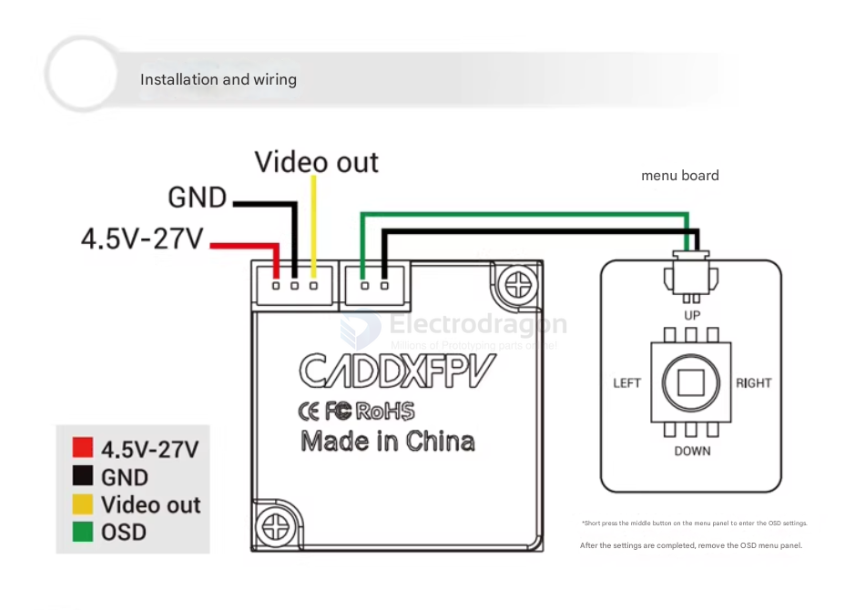

# camera-analog-dat

- [[camera-digital-dat]]

## RC Specified Camera 

- [[camera-analog-dat]] - [[CaddxFPV-dat]] - [[runCam-dat]]

## common pin out Analog 

- MENU 

- Video 
- GND 
- 5-36V 

## common camera cable 

- [[cable-dat]]

- 3P 1.0 mm - ANT - [[X12-dat]] - [[SH1.0-dat]]
- 3P 1.25 mm - [[caddxFPV-dat]] - ratel-pro

## ref 

- [[camera-dat]]