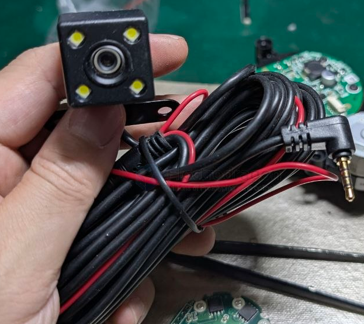
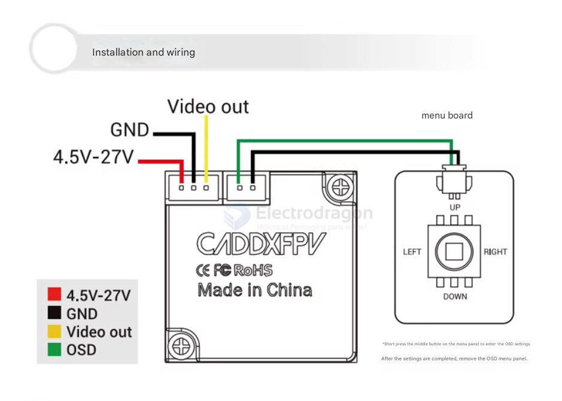
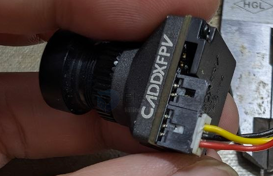

# camera-analog-dat

- [[camera-FPV-dat]] - [[camera-analog-dat]] - [[camera-digital-dat]] - [[caddxFPV-ratelpro-dat]] - [[runCam-dat]] - [[VTX-dat]]

- [[camera-digital-dat]] - [[camera-analog-dat]]

- [[CONN-XLR-dat]] - [[analog-dat]] - [[CONN-USB-dat]] - [[video-dat]] - [[sensor-camera-dat]] - [[camera-analog-dat]]

- [[conn-audio-dat]]

- [[easycap-dat]]

`USB Video Capture Card (Easy & Cheap):`

If you have an analog camera, you can plug its yellow video signal wire and ground wire into an `external USB video capture dongle` (often called an "`EasyCap`" or cheap HDMI/AV USB capture card meant for security cameras or retro gaming).

Plug the USB capture card into your PC and open a webcam viewer or OBS Studio. Keep in mind this will only show the raw camera image; it won't include Betaflight OSD unless the camera is routed through an FC with an active analog OSD chip and an external monitor/receiver setup.

## common analog sensor for car / truck surveillance

use - [[conn-audio-dat]] == signal normally == video out (CVBS) + power + GND

## RC Specified Camera 

- [[camera-analog-dat]] - [[CaddxFPV-dat]] - [[runCam-dat]]

## common pin out Analog 

- MENU 

- Video 
- GND 
- 5-36V 

- [[runcam-dat]] - [[camera-FPV-dat]] - [[camera-analog-dat]]

## common camera cable 

- [[cable-dat]]

- 3P 1.0 mm - ANT - [[X12-dat]] - [[SH1.0-dat]]
- 3P 1.25 mm - [[caddxFPV-dat]] - ratel-pro

## apps 

- [[camera-FPV-dat]] - [[camera-analog-dat]]

## ref 

- [[sensor-Camera-dat]]