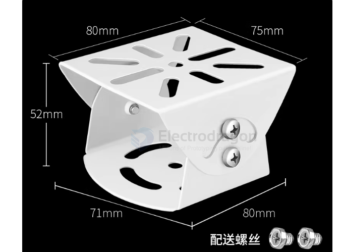
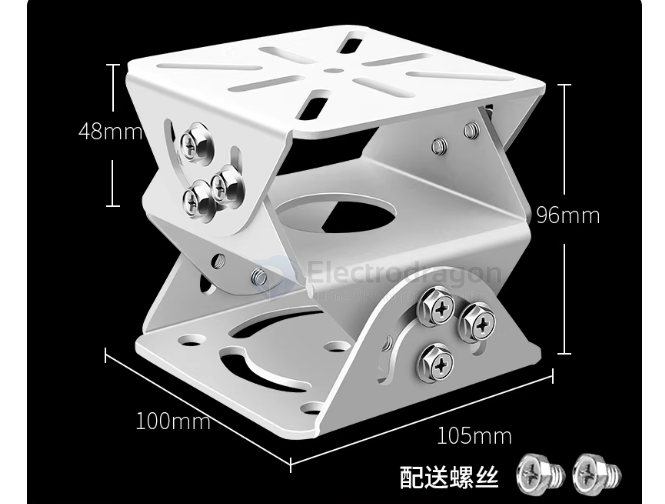

# camera-mount-dat

- [[sensor-camera-dat]] - [[camera-rack-dat]] - [[installation-dat]]

- [[camera-rack-dat]] - [[sensor-camera-dat]] - [[camera-wireless-dat]]

- [[gopro-dat]] - [[insta360-dat]] - [[DJI-dat]] - [[camera-rack-dat]] - [[sensor-camera-dat]]

- [[insta360-go-rack-dat]] - [[gopro-amount-dat]]

- [[FPV-dat]] - [[caddxFPV-ratelpro-dat]] - [[caddxFPV-dat]]

- [[runcam-dat]]

- [[fab-3d-print-dat]]

- [[X12-dat]]

- [[rack-dat]]

## on the tube 

- [[Hose-Clamp-dat]]

- [[camera-installation-dat]] - [[sensor-camera-dat]] - [[Hose-Clamp-dat]]

## on the rack 

2D rack 

3D rack 

## on the RC

- [[RC-dat]] - [[rc-aircraft-dat]] - [[FPV-dat]]

- [[camera-FPV-dat]] - [[camera-FPV-canopy-dat]] - [[FPV-build-dat]] - [[FPV-dat]] - [[VTX-dat]] - [[sensor-camera-dat]] - [[camera-mount-dat]]

## ref 

- [[insta360]] - [[gopro]] - [[insta360-go-rack]] - [[gopro-amount]]
