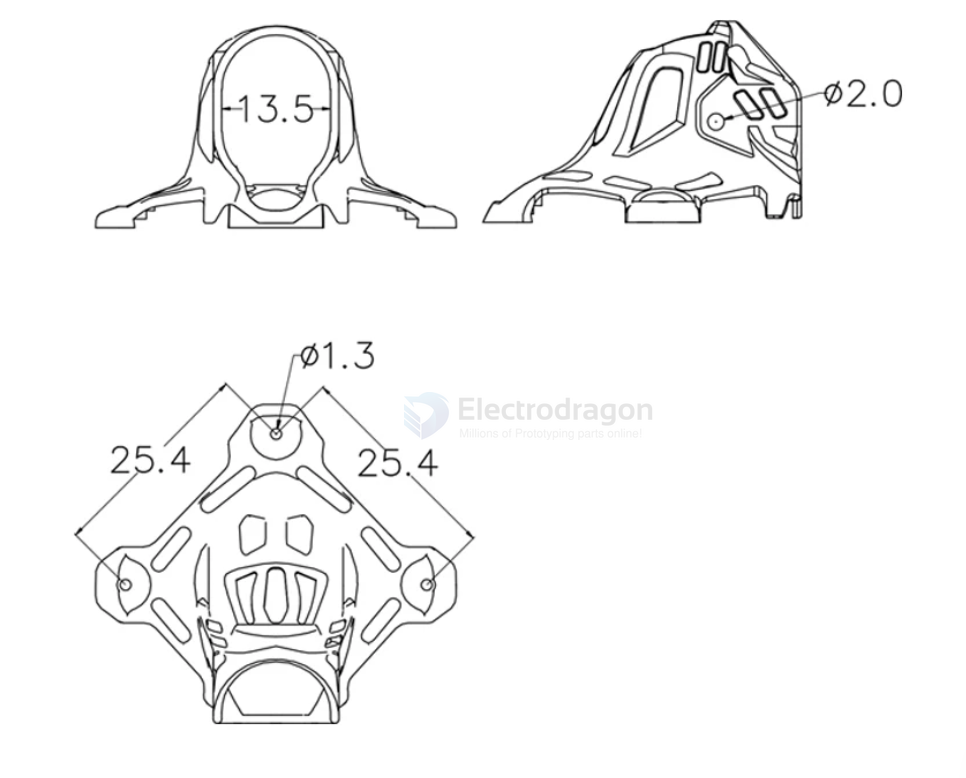
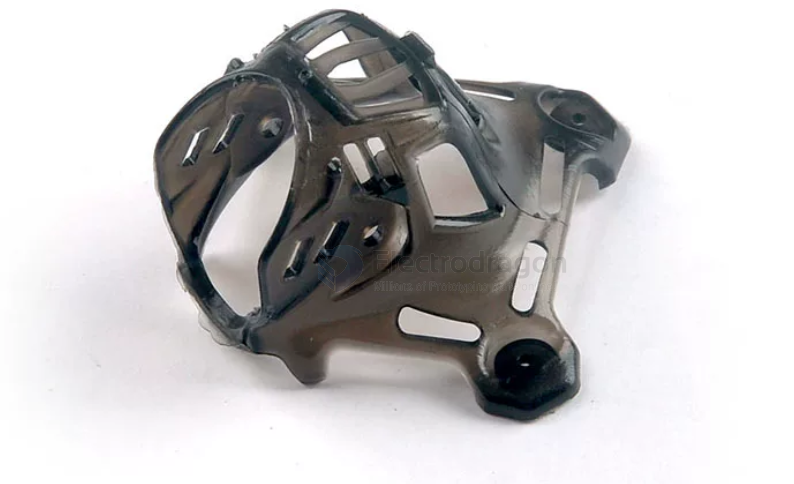
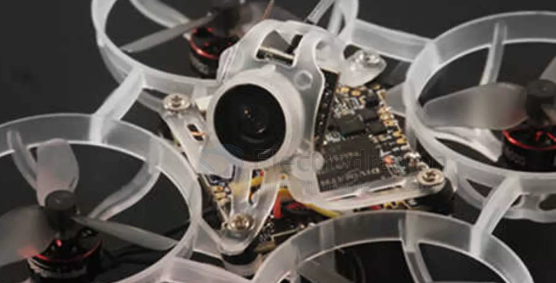
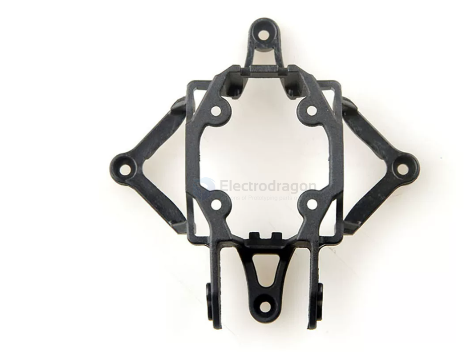
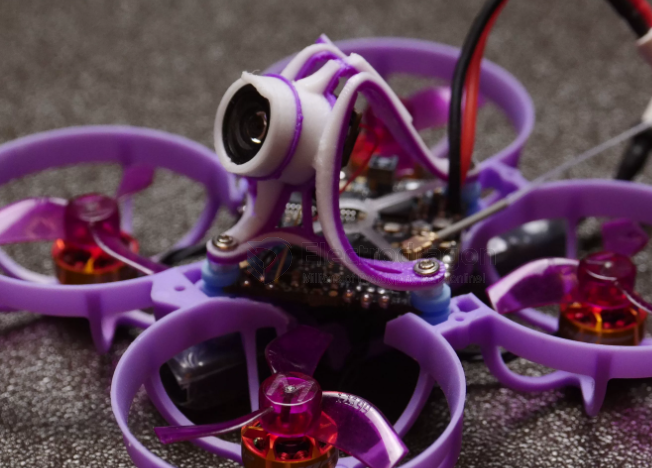
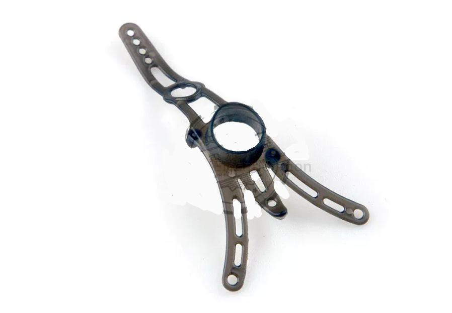
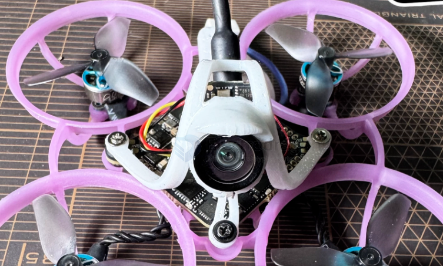

# camera-rack-dat

- [[sensor-camera-dat]] - [[camera-rack-dat]] - [[installation-dat]]

- [[camera-rack-dat]] - [[sensor-camera-dat]] - [[camera-wireless-dat]]

- [[gopro-dat]] - [[insta360-dat]] - [[DJI-dat]] - [[camera-rack-dat]] - [[sensor-camera-dat]]

- [[FPV-dat]] - [[caddxFPV-ratelpro-dat]] - [[caddxFPV-dat]]

- [[runcam-dat]]

- [[fab-3d-print-dat]]

- [[X12-dat]]

## FPV camera canopy 

digital DJI O3 

- Item Name: Camera mount bracket for Mobula6 2024
- Material: PP
- Color option: Transparent black/Transparent white
- Net Weight: 0.62g
- Camera angle could adjustable easily
- Transparent black for Mobula62024, transparent for Mobula6 ECO 2024
- Package Included:
- 1 x Camera mount bracket
- 2 x M1.2×5 screws

- [[betaFPV-air-2-dat]] - [[betaFPV-dat]] == lens dia 9-10mm 

## ref 

- [[insta360]] - [[gopro]] - [[insta360-go-rack]] - [[gopro-amount]]