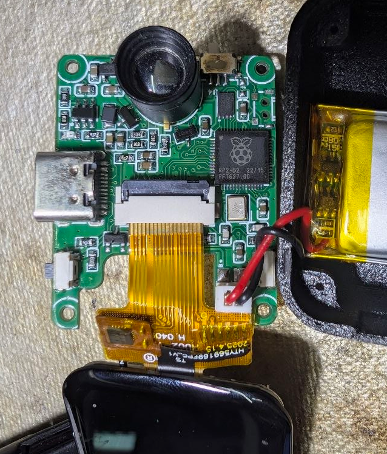
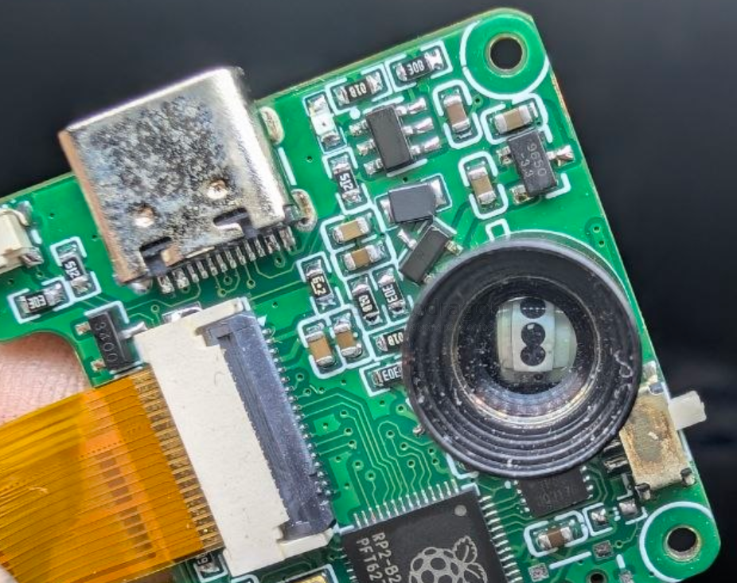
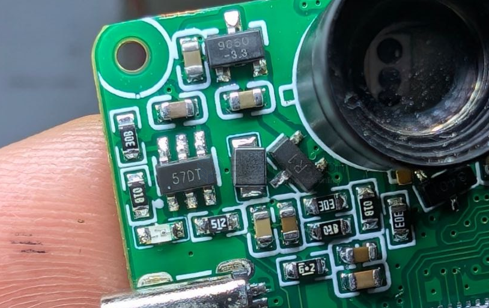
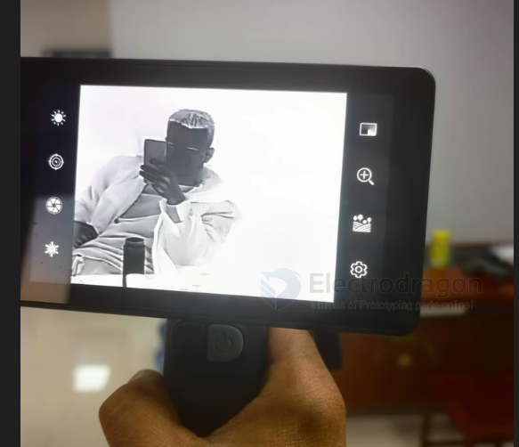
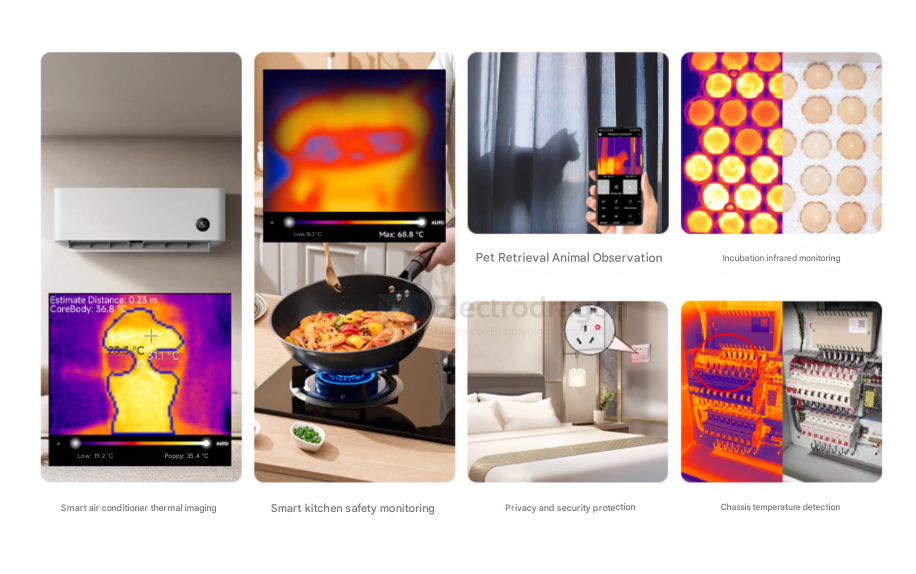

# camera-thermal-dat

- [[sensor-camera-dat]] - [[camera-wifi-dat]] - [[camera-surveillance-dat]] - [[camera-thermal-dat]]

- [[STH1065-dat]] - [[STH1066-dat]] - [[STH1067-dat]] - [[MLX90614-dat]] - [[sensor-camera-dat]] - [[camera-thermal-dat]]

海曼5.0长焦

## build 

- [[tech-dat]] - [[RPI-MCU-dat]]

- [[LDO-dat]] - [[SL9650-dat]] - [[slkor-dat]]

- 1P503 ? IP503 ? - [[flash-dat]]

- [[mosfet-dat]] 

57dt sot23-6 ? 

## apps

## tech 

- [[allwinner-dat]] - [[T113-dat]]

- [[EA3036-dat]] - [[STC-dat]]

- [[hikvision-dat]] 

- [[MLX90640-dat]]

- [[LCD-dat]]

- [[RTL8723-dat]]

## ref 

- [[infrared-dat]] - [[sensor-Camera-dat]]

- [[Thermal-imaging-camera]]

- [[camera-thermal]] - [[app]]