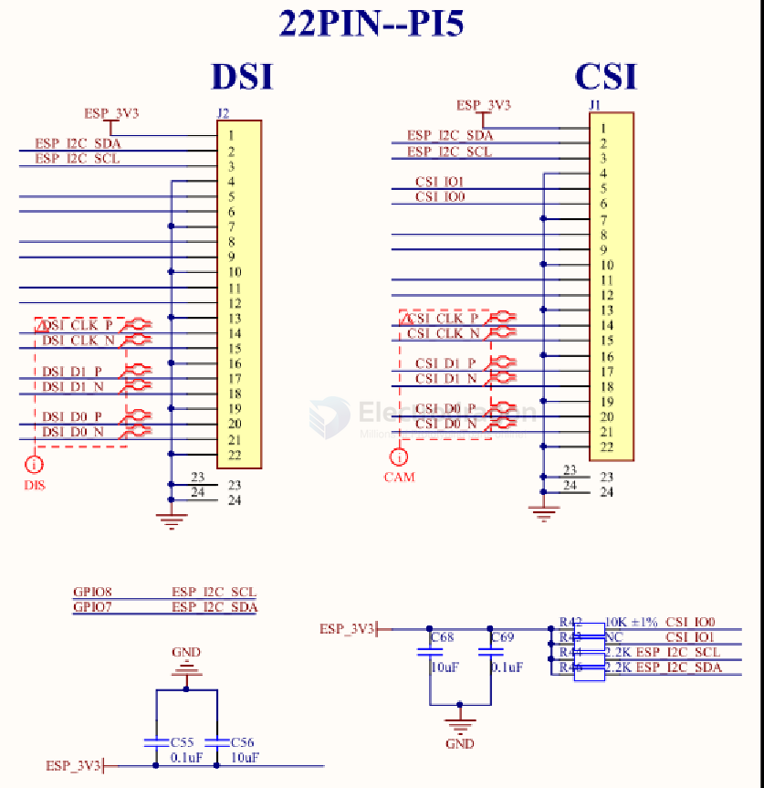

# CSI-dat

**CSI (Camera Serial Interface)**

Uses a 15-pin MIPI CSI-2 ribbon cable connector.

Designed for official Raspberry Pi Camera Modules.

Offers high-speed data transfer directly to the Raspberry Pi’s GPU.

Supports Raspberry Pi Camera Module v1, v2, and v3, as well as the High-Quality Camera.

Provides lower latency and better performance compared to USB.

## SCH 1 DSI + CSI interface 

## ref 

- [[DSI-dat]] - [[CSI-dat]] 

- [[camera-dat]]