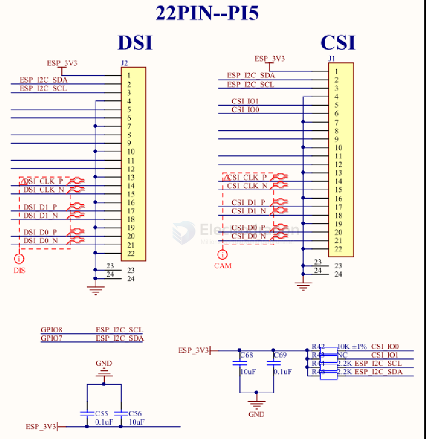
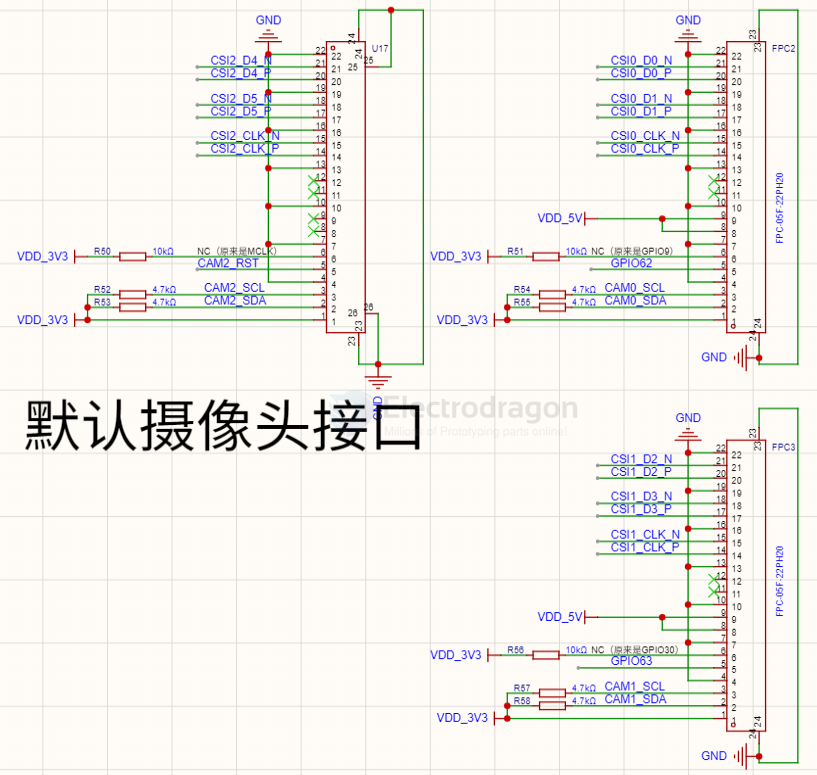

# camera-CSI-dat

- [[DSI-dat]] - [[CSI-dat]] - [[MIPI-dat]] - [[MIPI-DSI-dat]] - [[camera-CSI-dat]] - [[DVP-display-dat]]

- [[camera-DVP-dat]] - [[camera-CSI-dat]] - [[camera-interface-dat]]

**CSI (Camera Serial Interface)**

Uses a 15-pin MIPI CSI-2 ribbon cable connector.

Designed for official Raspberry Pi Camera Modules.

Offers high-speed data transfer directly to the Raspberry Pi’s GPU.

Supports Raspberry Pi Camera Module v1, v2, and v3, as well as the High-Quality Camera.

Provides lower latency and better performance compared to USB.

## build 

- [[sensor-camera-CSI-dat]] - [[sensor-camera-dat]]

build 1 

SCH 1 DSI + CSI interface 

build 2 

CSI1 CSI2 CSI3 - [[K230D-dat]]

## ref 

- [[DSI-dat]] - [[CSI-dat]] 

- [[camera-dat]]