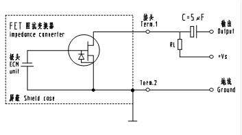
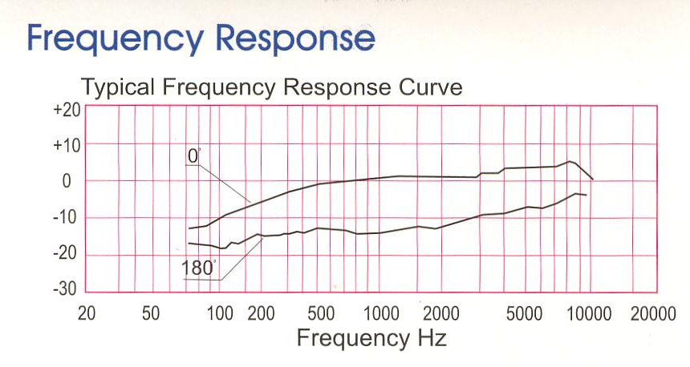

# Electret-Condenser-Microphone-dat

- in short == ECM 

An **Electret Condenser Microphone (ECM)** is a type of microphone that uses an electret material for its diaphragm and a built-in field-effect transistor (FET) to amplify the signal. It is one of the most common types of microphones used in consumer audio devices.

Here's how the relationship between an ECM and the MAX9812 or ICS-41434 compares:

### **Electret Condenser Microphone (ECM)**:

1. **Type**: An analog microphone that uses a capacitor-based diaphragm (the electret) to capture sound.
2. **Powering**: Requires a power source known as **bias voltage** (typically 1.5V to 10V), which is applied to the diaphragm and the internal FET for amplification.
3. **Signal Output**: Provides an analog output signal that needs additional circuitry for amplification or processing.
4. **Sensitivity**: Generally offers good sensitivity but can be susceptible to noise or interference unless properly shielded and processed.
5. **Use Case**: Commonly used in a wide variety of applications, including consumer audio devices, microphones for cameras, recording, and communication systems.

## board 

- [[SSL1017-dat]]

## EM-B6050UL

## 适用范围： Scope	

本规格书适用于驻极体式电容传声器 - This spccification applies electret condenser microphone (E.C.M)

型号： - Model No.	EM-B6050UL

使用条件： - Operation Condition

- 3.1 环境温度 - Temperature	-20~+70℃
- 3.2 相对湿度 - Rel,Humidity	35%~85%RH
- 3.3 大气压力 - Pressure	86~106Kpa
- 3.4 环境噪声 - Environmental Noise	36dB  (最大) - 36dB  (Maximum)
- 3.5 工作电压范围 - Operation Voltage	1~10VDC
- 3.6 接地方式： - Earth	⊙

电性能 Electrical Characteristics

- 4.1 基准工作电压 - StandardOperationVoltage	4.5VDC
- 4.2 阻抗 - Impedance	小于2.2KΩ  - Less than 2.2KΩ
- 4.3 消耗电流 - Current Consumption	0.5mA   (最大) - 0.5mA   (Maximum)
- 4.4 灵敏度 - Sensitivity	-50dB±3dB(0dB=1V/Pa,1KHz) -- Vs=4.5V  R1=2.2KΩ
- 4.5 指向性 - Directivity	单指向性 - Unidirectional
- 4.6 信噪比 - S/N Ratio	56dB(最小) - 56dB(Minimum)

4.7 测试电路图 - Schematic Diagram - Vs= 1.5V ； - R1=680Ω； - C=1uF

4.8 测试环境温度 -    Test Temperature -    测试环境湿度 -    Rel.Humidity

20℃±2℃ - 45%~65%RH

4.9 频率响应曲线 - Frequency Response

