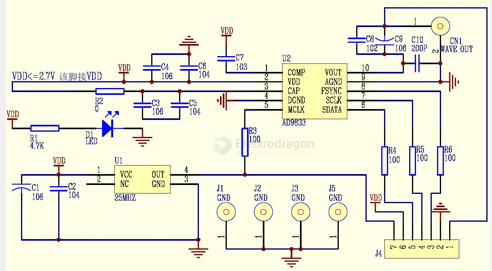
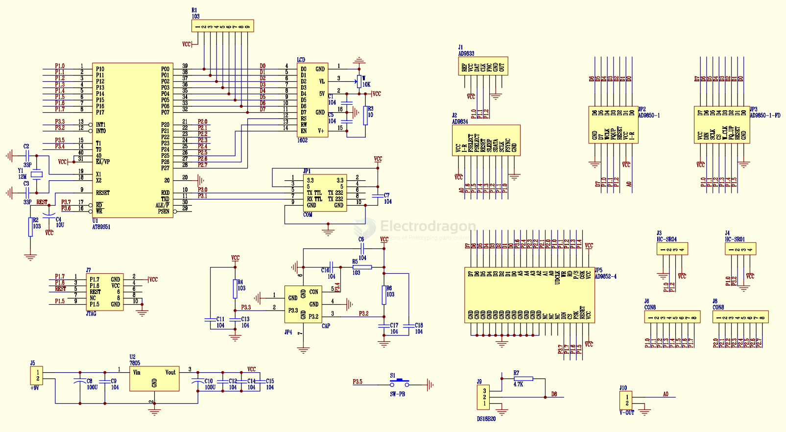
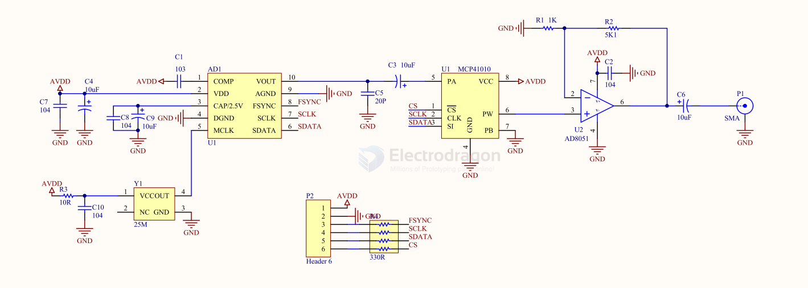

# generator-wave-dat

AD9833 

Low Power, 12.65 mW, 2.3 V to 5.5 V,
Programmable Waveform Generator

## SCH 

ad9833 pga输出口是经过放大后的信号。vout口是ad9833原始信号。pga输出口是可以通过程序调节幅值的，vout幅值固定。

- [[MCP41010-dat]]

