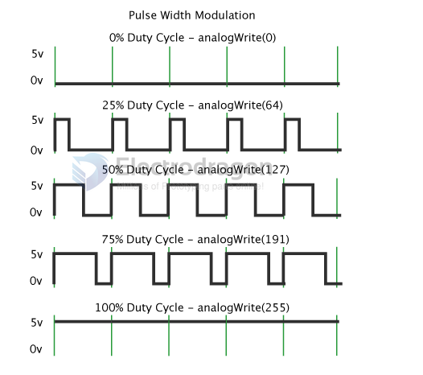

# pulse-dat.md

In the graphic below, the green lines represent a regular time period. This duration or period is the inverse of the PWM frequency. In other words, with Arduino's PWM frequency at about 500Hz, the green lines would measure 2 milliseconds each. 

A call to analogWrite() is on a scale of 0 - 255, such that analogWrite(255) requests a 100% duty cycle (always on), 

and analogWrite(127) is a 50% duty cycle (on half the time) for example.

- ref - https://docs.arduino.cc/learn/microcontrollers/analog-output/

