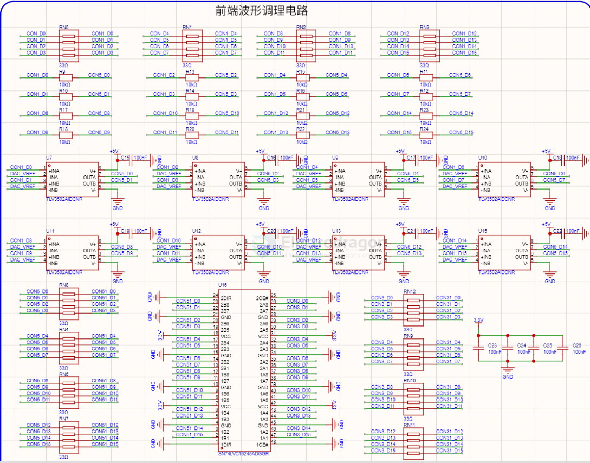
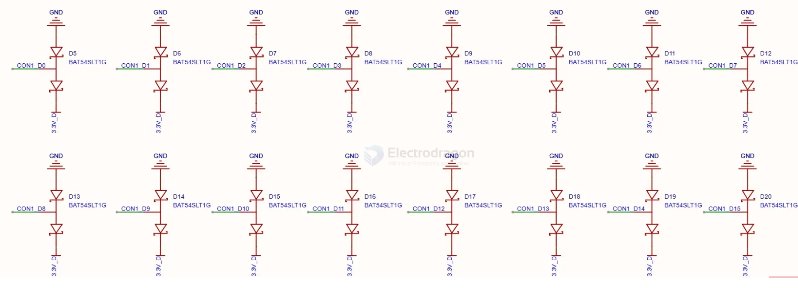

# signal-digital-dat

- [[logic-dat]] - [[digital-dat]] - [[signal-dat]] - [[signal-digital-dat]]

## front-end input 

build 2 - [[TLV3502-dat]] - [[TI-DAC-dat]]

build 1 

采用双向钳位二极管保护电路，每个输入通道配备独立的钳位保护：

    信号输入 ──── 限流电阻 ──┬── 至 FPGA I/O
                            │
                            ├── D1 ─── VCC  (上钳位至 3.3V)
                            │
                            └── D2 ─── GND  (下钳位至 GND)

- 上钳位：肖特基二极管将电压钳位至 VCC + Vf（约 3.8V）
- 下钳位：肖特基二极管将电压钳位至 GND - Vf（约 -0.7V）
- 限流电阻：100Ω 串联限流，抑制浪涌电流
- 输入电压范围：0 ~ 5V（兼容 3.3V / 5V 逻辑电平）

## ref 

