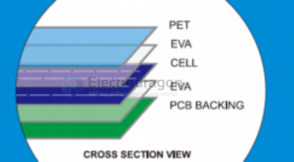

# solar-panel-dat

## Common solar panel types 

There are 3 main types of solar panels available in the solar market today. They’re 
- monocrystalline, 
- polycrystalline and 
- thin-film solar panels. 

## Common Packaging Types 

Types of Commercial Solar Panels and their structures 
- PET Laminated Solar Panel 
- Epoxy Resin Laminated Solar panel 
- Standard Glass Laminated Solar panel 
- Frameless Glass Laminated Solar panel 
- Back-contact semi-flexible Solar panel 
- Thin film glass laminated Solar panel 
- Polycrystalline silicon solar cell

## PET Laminated Solar panel

### MATERIALS

PET (also known as Polyethylene terephalate) is a type of plastic which is commonly used for bottled water, takeaway containers and household products due to their material stability, wear resistant and non-toxic nature. It’s high transparency and good scratch resistant also makes it suitable as a protective layer above the solar cell. Solar cells used can be monocrystalline or polycrystalline.

This allows good sunlight absorption while keeping the solar panel lightweight (compared to glass laminated solar panels)

### PROCESS:

The PET laminated solar panel is made by placing layers of PET, EVA, solar cell and PCB together. They are then laminated by machine at a temperature of 135 degrees Celcius which will melt the encapsulating materials together to form a watertight bond.

#### HIGHLIGHTS:

High clarity
UV resistant
Humidity resistant
Good scratch resistant
Consistent textured surface
Attractive appearance

### APPLICATIONS:

It is widely used on small plug-n-play outdoor solar LED lights, folding solar chargers, solar backpacks and other solar gadgets. It is usually used for low voltage and low power applications.

LIFESPAN: 3 year +

## ref 

- [[solar-panel]]