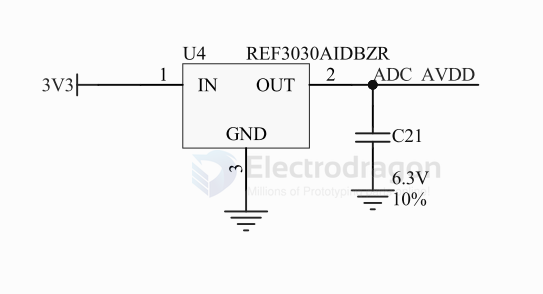

# voltage-reference-dat

== V_ref 

- [[TI-dat]]

## REF30

REF30E and REF30, Low Current Voltage Reference in SOT-23-3

Output voltage options
- REF30E: 1.25V to 5V
- REF30: 1.25V to 4.096V

- [[ADC-dat]]

for ADC-AVDD 

- [[peripherals-dat]]

## TL431

## more 

- Voltage References | LM336Z25 - 2.49 V, 2% Programmable Shunt Regulator

## ref 

- [[tech-dat]] 

- [[voltage-reference]]