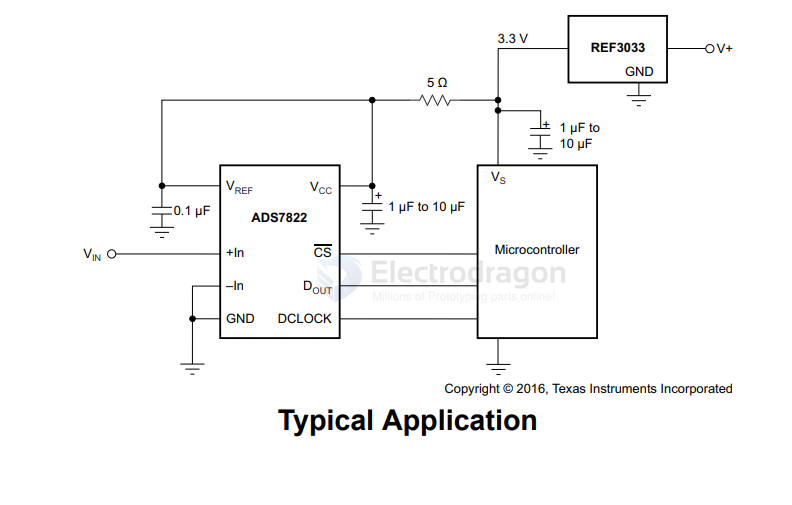

# voltage-reference-dat

== V_ref 

- [[TI-dat]]

## REF30

REF30E and REF30, Low Current Voltage Reference in SOT-23-3

Output voltage options
- REF30E: 1.25V to 5V
- REF30: 1.25V to 4.096V

- [[ADC-dat]]

for ADC-AVDD 

- [[peripherals-dat]]

## TL431

## voltage reference 

- ADR435BRZ - Ultralow Noise XFET Voltage References with Current Sink and Source Capability

- [[TL431-dat]] - [[voltage-reference-dat]]

- [[supervisory-dat]]

| Feature                  | Voltage Reference         | Supervisory IC                     |
| ------------------------ | ------------------------- | ---------------------------------- |
| Purpose                  | Provide precise voltage   | Monitor power & generate reset     |
| Output type              | Analog voltage            | Digital reset                      |
| Accuracy                 | Very high (ppm/°C)        | Moderate (1–3%)                    |
| Noise                    | Very low                  | Not relevant                       |
| Used in                  | Analog precision circuits | MCU, CPU, digital systems          |
| Extra functions          | None                      | Watchdog, manual reset, sequencing |
| Affects system start-up? | No                        | Yes                                |

## more 

- Voltage References | LM336Z25 - 2.49 V, 2% Programmable Shunt Regulator

ADM708SARZ

## ref 

- [[tech-dat]] 

- [[voltage-reference]]