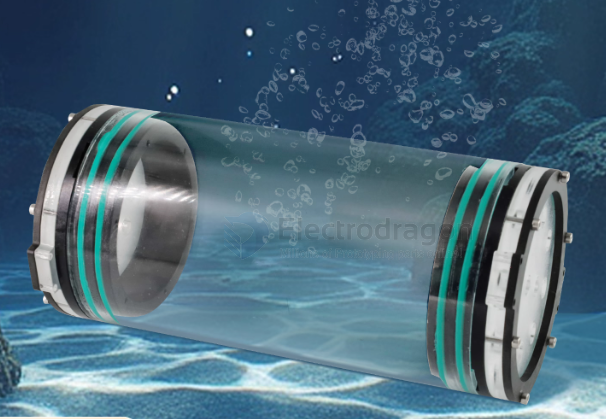
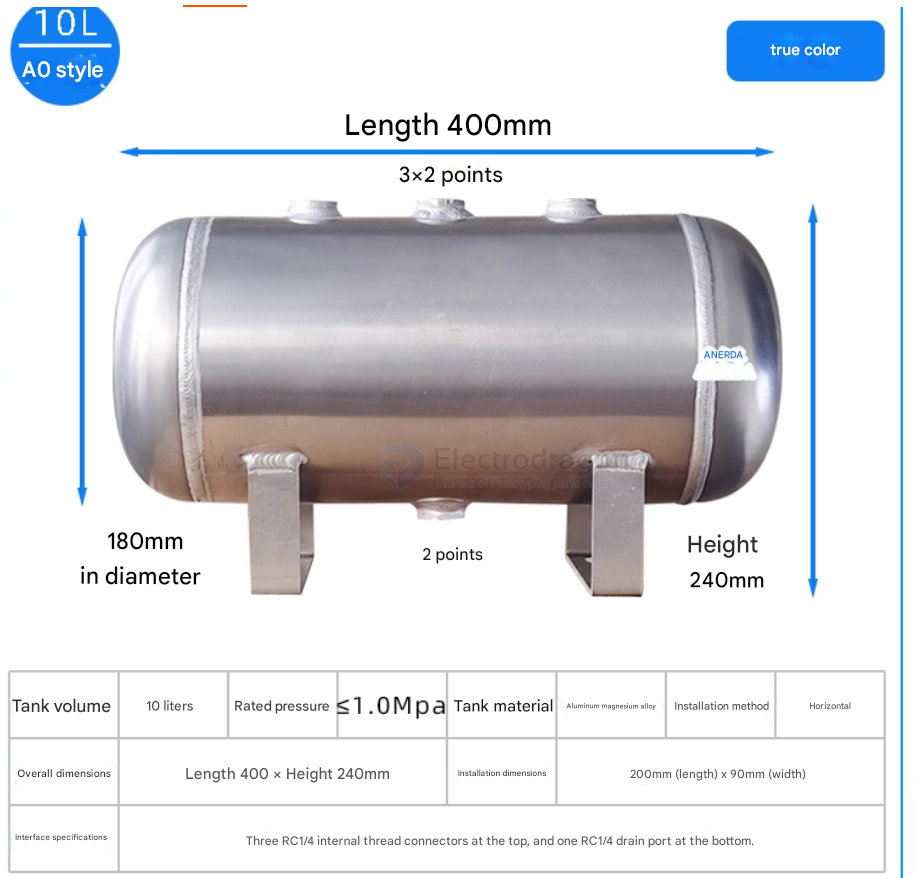
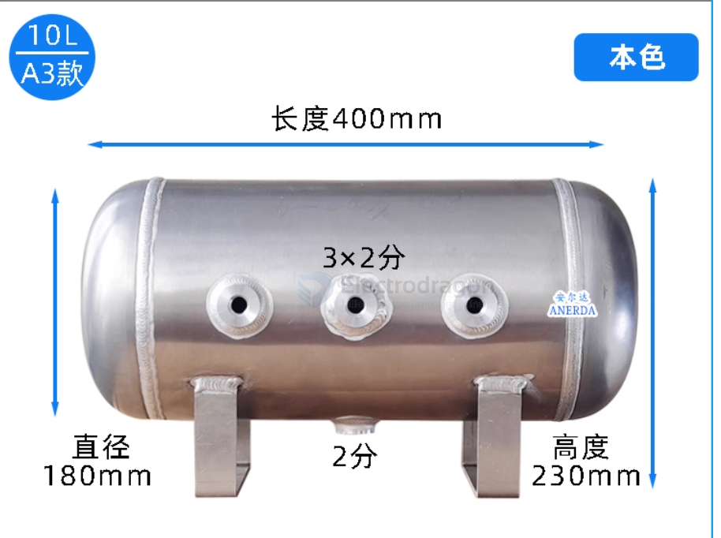

# waterproof-container-dat

- PVC tube
- acrylic box

## PMMA tube 

- [[PMMA-dat]]

## aluminum canister

- Theoretical minimum: <1 mm for a tiny cylinder.  
- Practical safe design: 3–5 mm aluminum alloy (6061-T6) cylinder for 100 m depth.

## ref 

- [[waterproof]] - [[waterproof-container]]

- [[waterproof-dat]]