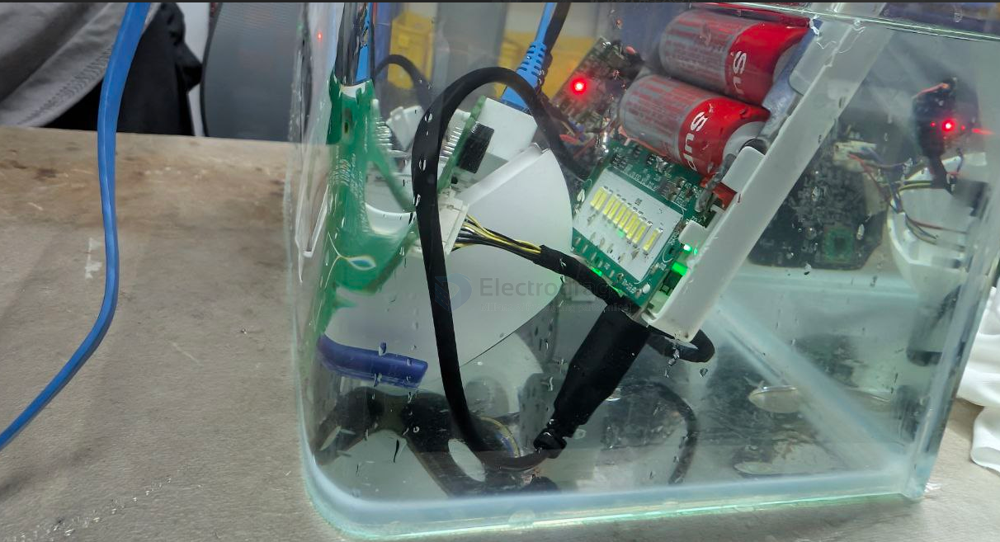
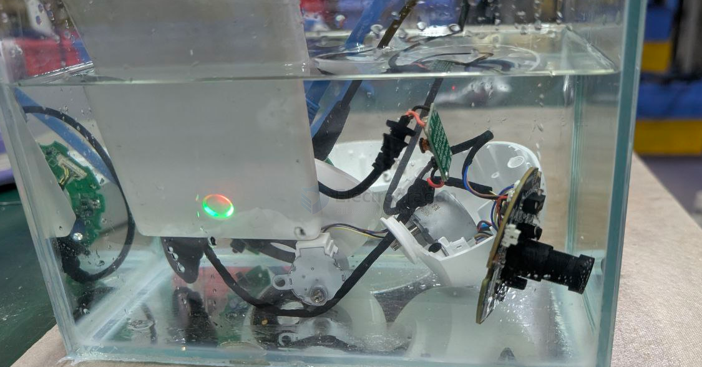
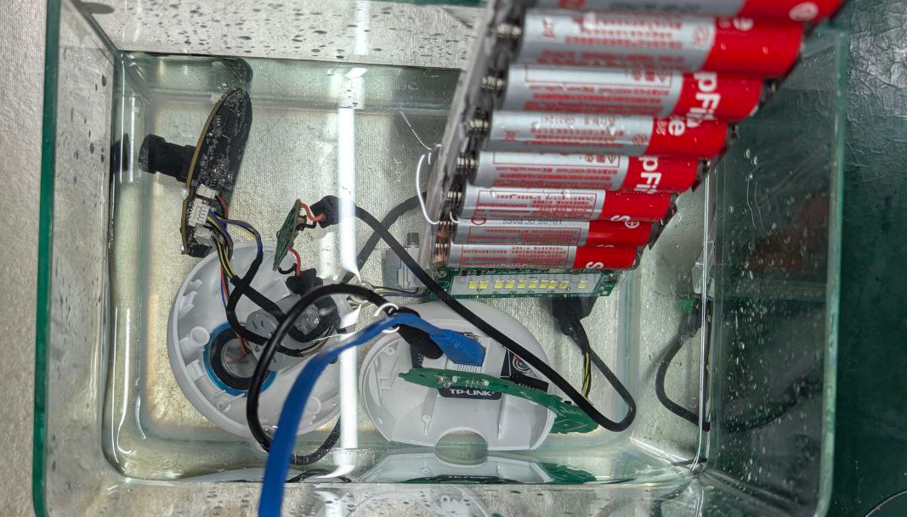
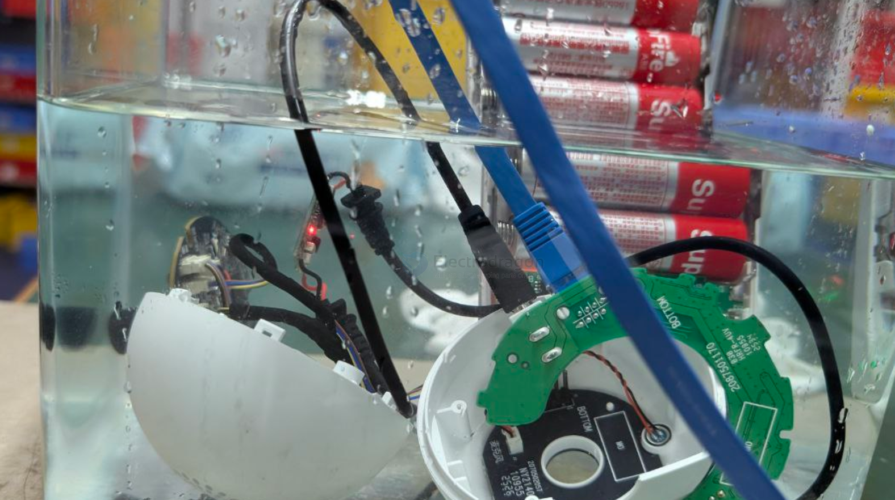

# waterproof-dat

- [[CONN-waterproof-dat]]

- [[waterproof-connector-dat]]

- [[motor-waterproof-dat]] - [[motor-dat]] - [[servo-waterproof-dat]]

- [[shaft-dat]] - [[shaft-waterproof-dat]] - [[waterproof-dat]]

- [[waterproof-container-dat]]

- [[waterproof-sealant-dat]]

- [[glue-waterproof-dat]] - [[waterproof-tape-dat]] == 布基胶带 

- [[Conformal-Coating-dat]] - [[protection-dat]]

## boards 

- [[SMO1085-dat]]

## waterproof level 

- IP69 

- [[IP68-dat]] 

- PA66 - [[plastic-dat]]

- IPX68 

## tech 

- [[pressure-dat]]

- [[CONN-waterproof-dat]] - [[CONN-dat]]

- [[silicon-grease-dat]]

## apps 

- [[submarine-dat]] - [[submersible-dat]]

## demo 

- [[sensor-camera-dat]] - [[power-dat]] - [[network-dat]] - [[ethernet-dat]] - [[TPLINK-dat]]

## ref 

- [[waterproof]]

- [[onshape-dat]]

- [[waterproof-dat]] - [[silicon-grease-dat]]