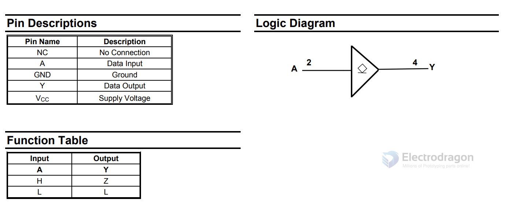
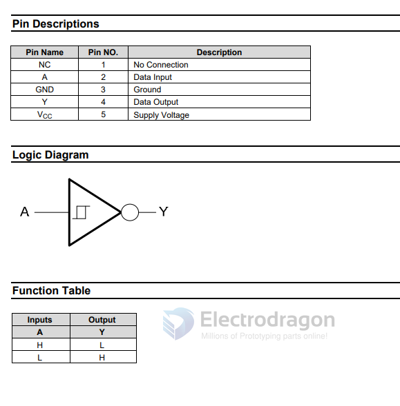

# buffer-dat 

- [[octal-buffer]] - [[shift-register]]

## SINGLE BUFFER/DRIVER WITH OPEN DRAIN OUTPUT

74LVC1G07

## SINGLE SCHMITT-TRIGGER INVERETER

74AHC1G14

## SINGLE BUFFER GATE WITH 3-STATE OUTPUT

## SN74LVC2G04 Dual Inverter Gate

