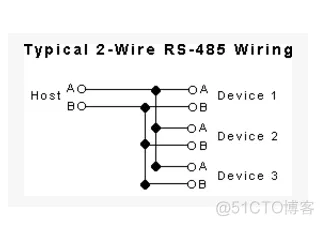
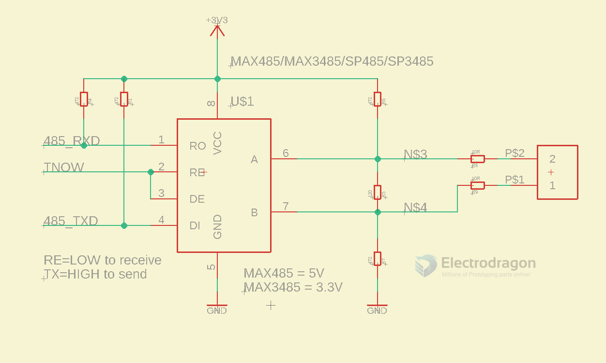

# RS485 DAT 

## interface 

- A
- B 

## current limiter 
- 24v ~ 30ma, need ~ 800ohms current-limiting resistor
- 3.3V ~ 4mA

## wiring 

## SCH 

## Debug 

- A / B reversed wiring = incorrect error data 

## Boards 

- [[DPR1060-dat]] - [[MSP1076-dat]]

- [[WCH-dat]]