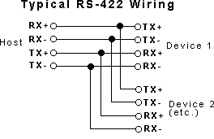

# RS422-dat

Wiring 
- Y = TXD+ --- B = RXD+
- Z = TXD- --- A = RXD-
- B = RXD+ --- Y = TXD+
- A = RXD- --- Z = TXD-
or 
- A - Y 
- B - Z
- Y - A 
- Z - B

Definitions 
- Y = TXD+
- Z = TXD- 
- A = RXD-
- B = RXD+

## ref 

https://en.wikipedia.org/wiki/RS-422
https://www.omega.com/en-us/resources/rs422-rs485-rs232

- [[DPR1097-dat]]