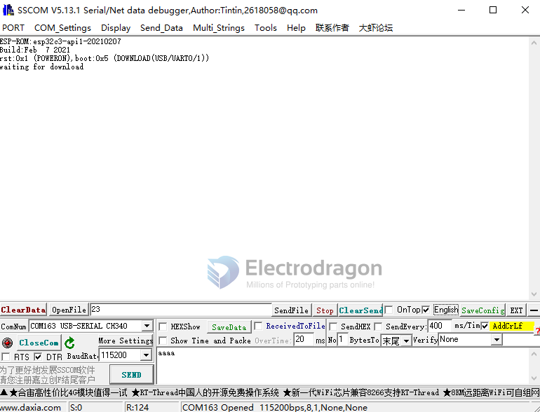

# USB TTL Dat 

- Green = TX
- White = Rx
- Red = VCC
- Black = GND

## Product links 

- PL2303 - https://www.electrodragon.com/product/pl2303ta-usb-ttl-usb-serial-cable-win-88-1-compatible/

## Use case 

### programming for ESP32 or ESP8266 : 
- TXD -> RXD
- RXD -> TXD
- 5V -> 5V
- GND -> GND. 

Booting Mode select

           Hold down IO0 button, and connect power supply to enter into flash  mode
    do NOT Hold down IO0 button, and connect power supply to enter into normal mode

- please note for [[ESP32-C3-dat]], the programming mode select pin is (button) IO9

### Programming Wiring 

- for [[NWI1126-dat]]

### Confirm selected Mode 

The COM port monitor used here is [[com-monitor-dat]]

### troubleshooting checklist
reverse TX RX in case wrong wiring of communication

software [[com-monitor-dat]]

other interface 
- [[RS485-DAT]] - [[RS232-dat]] - [[I2C-dat]]

- [[ESP-SDK]]