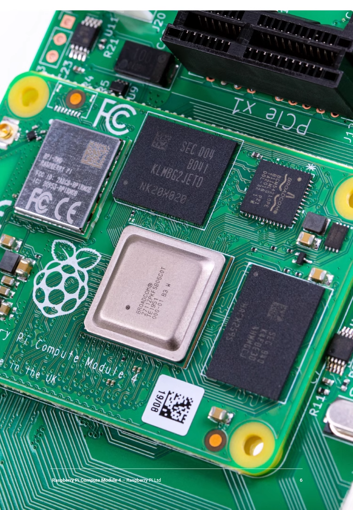
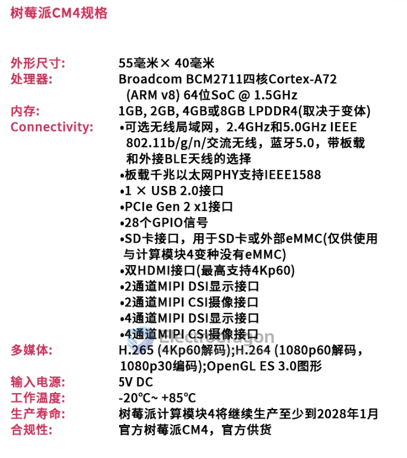

# RPI-CM-dat

The Raspberry Pi Compute Module is a small, powerful, and customizable single-board computer designed for embedded applications. It is based on the same architecture as the Raspberry Pi boards but in a more compact form factor. The Compute Module provides a more flexible and modular approach compared to the standard Raspberry Pi boards.

Here are some key features of the Raspberry Pi Compute Module:

- Broadcom BCM2835 processor with ARM Cortex-A7 CPU
- 512MB/1GB RAM options
- 4GB eMMC flash memory (optional)
- 200-pin SODIMM connector for easy integration
- HDMI and USB interfaces via breakout board
- Camera and display interfaces
- Support for industrial temperature range (-20°C to +70°C)
- Support for various operating systems, including Linux and Windows 10 IoT Core

To learn more about the Raspberry Pi Compute Module, you can visit the official Raspberry Pi website:

- Compute Module: https://www.raspberrypi.org/products/compute-module-3-plus/
- Compute Module Datasheet: https://datasheets.raspberrypi.org/compute/CM3Plus/CM3Plus-datasheet.pdf
- If you are looking for code examples and projects related to the Raspberry Pi Compute Module, you can explore the Raspberry Pi GitHub repository: Raspberry Pi GitHub: https://github.com/raspberrypi

## Specs 

## Names 

- CM4001008

## Features 

- on module CPU BCM2711 

### On module storage EMMC 

- flash into [[RPI-OS-dat]]

### On module wifi 

## ref 

- [[RPI-CM4-expansion-board-dat]]

- datasheet [[cm4-datasheet.pdf]]

- [[RPI-CM]]