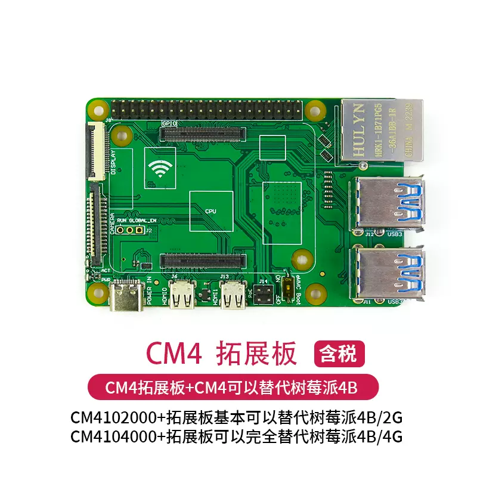

# RPI-CM4-expansion-board-dat

## Expansion Board 

### IO Expansion board 

## RPI CM4IO Board 

- full scale large size image - https://pi4j.com/1.3/images/pi4j-rpi-cm4-header.png

### ref 

- https://www.raspberrypi.com/products/compute-module-4-io-board/
- datasheet https://datasheets.raspberrypi.com/cm4/cm4-datasheet.pdf
- kicad file - 

## Variation Board 

- [[RMP-RPI-CM4-dat]]

- RPI-CM4-POE
- RPI-CM4-POE_4G
- RPI-CM4-Base_B
  - SCH - [[CM4-IO-BASE-B_V4_SchDoc.pdf]]
- RPI-CM4-Base_ETH2
- RPI-CM4-NANO

## periperal 

- protocol [[HDMI-dat]] - [[M2-dat]] - [[CSI-dat]] - [[DSI-dat]] - [[SDIO-dat]] 

- network [[ethernet-dat]] 

- misc [[fan-driver-dat]]  

- power supply [[dcdc-bulk-dat]] 

- USB [[USB-switch-dat]] - [[type-c-dat]] - [[USB-hub-dat]]

- VDDIO 

- Mode select 

- LEDs 

## ref

- [[RPI-CM4-expansion-board]]

minimum carrier board 
- Small carrier board for Raspberry Pi CM4 - [mincab](https://uplab.pro/2021/10/mincab/)
- [Minimal_carrier_board_for_CM4](https://github.com/dronecz/Minimal_carrier_board_for_CM4)