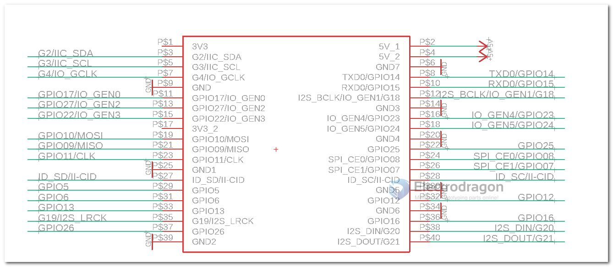

# raspberry pi dat 

## RPI4 

- BCM2711B0: cortex-A72 

## I2C 

- turn on I2C functions at [[raspi-config]]

## Pin Definitions 

Version 1 from [[MPC1111-dat]]

## demo code 

https://github.com/Edragon/RPI