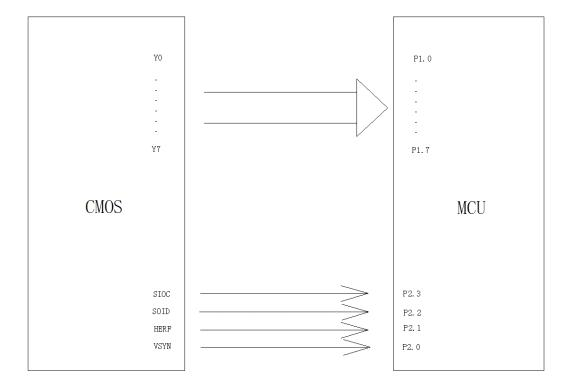
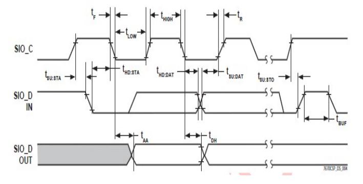
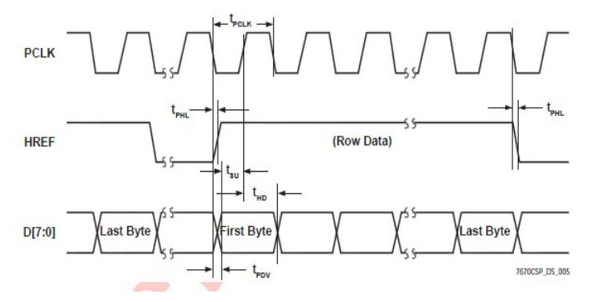

# FIFO-dat 

### Basic Principle

OV7670 FIFO camera, image sensor and image buffer pieces AL422B combine to solve the problem of low-end microcontroller image acquisition speed bottleneck. Basic principle:

User according to the figure above simply the fifo read data timing control pin, data can be read directly by the MCU IO port data into memory or sent to the screen memory display can be operated by low-speed MCU control, and simple processing of the data, such as black and white identification.

The OV7670 with FIFO module, image acquisition and control with buffer storage space a module is able to slow the MCU. This module adds a FIFO (first-in, first-out) memory chips, the same 30w-pixel CMOS image photosensitive chip, 3.6mm focal length of the lens and the lens mount, onboard various power CMOS chip (power requirements are detailed in chip data file), the board at the same time leads to the control pins and data pins, easy to operate and use.

As control sensor pin defined as follows:

### Sequence

Using the FIFO as data buffering, data acquisition is greatly simple, users only need to be concerned about is how to read, do not need to worry about how specific data is collected, it can be reduced or even do not care about the CMOS control and timing relationships,image acquisition.

Control sequence is as follows:

