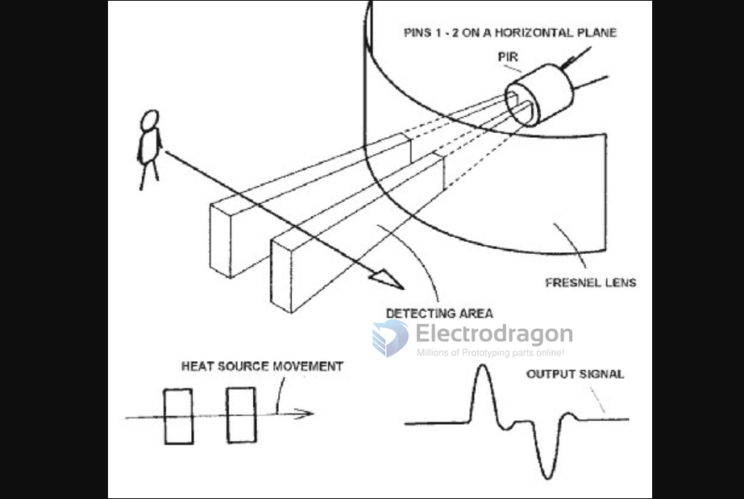
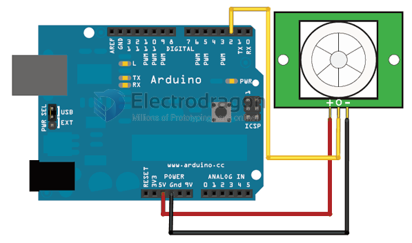

# PIR-sensor-dat

- legacy wiki page - https://w.electrodragon.com/w/PIR_sensor

## Boards 

- [[SMO1088-dat]] - [[SMOS026-dat]] - [[SMO1060-dat]]

## Working priciple 

## Arduino Demo Code 

- http://playground.arduino.cc/Code/PIRsense

Connecting PIR sensors to a microcontroller is really simple. The PIR acts as a digital output so all you need to do is listen for the pin to flip high (detected) or low (not detected).

Its likely that you'll want reriggering, so be sure to put the jumper in the H position!

Power the PIR with 5V and connect ground to ground. Then connect the output to a digital pin. In this example we'll use pin 2.
See the following picture about how it connects:

Without a microcontroller, PIR sensor can also be a simple TTL signal control relay, to use on many application such as road light!

Use following code to read the PIR value:

    /*
    * PIR sensor tester
    */
    
    int ledPin = 13;                // choose the pin for the LED
    int inputPin = 2;               // choose the input pin (for PIR sensor)
    int pirState = LOW;             // we start, assuming no motion detected
    int val = 0;                    // variable for reading the pin status
    
    void setup() {
    pinMode(ledPin, OUTPUT);      // declare LED as output
    pinMode(inputPin, INPUT);     // declare sensor as input
    
    Serial.begin(9600);
    }
    
    void loop(){
    val = digitalRead(inputPin);  // read input value
    if (val == HIGH) {            // check if the input is HIGH
        digitalWrite(ledPin, HIGH);  // turn LED ON
        if (pirState == LOW) {
        // we have just turned on
        Serial.println("Motion detected!");
        // We only want to print on the output change, not state
        pirState = HIGH;
        }
    } else {
        digitalWrite(ledPin, LOW); // turn LED OFF
        if (pirState == HIGH){
        // we have just turned of
        Serial.println("Motion ended!");
        // We only want to print on the output change, not state
        pirState = LOW;
        }
    }
    }

## Note of the sensing 
* Sensor module is powered up after a minute, in this initialization time intervals during this module will output 0-3 times, a minute later enters the standby state.
  
* Should try to avoid the lights and other sources of interference close direct module surface of the lens, in order to avoid the introduction of interference signal malfunction; environment should avoid the wind flow, the wind will cause interference on the sensor.
  
* Sensor module with dual probe, the probe window is rectangular, dual (A B) in both ends of the longitudinal direction so when the human body from '''left to right or right to left''' through the infrared spectrum to reach dual time, distance difference, the greater the difference, the more sensitive the sensor,
when the human body from the front to the probe or from top to bottom or from bottom to top on the direction traveled, double detects changes in the distance of less than infrared spectroscopy, no difference value the sensor insensitive or does not work;

* '''The dual direction of sensor should be installed parallel as far as possible in inline with human movement.''' In order to increase the sensor angle range, the module using a circular lens also makes the probe surrounded induction, but the left and right sides still up and down in both directions sensing range, sensitivity, still need to try to install the above requirements.
