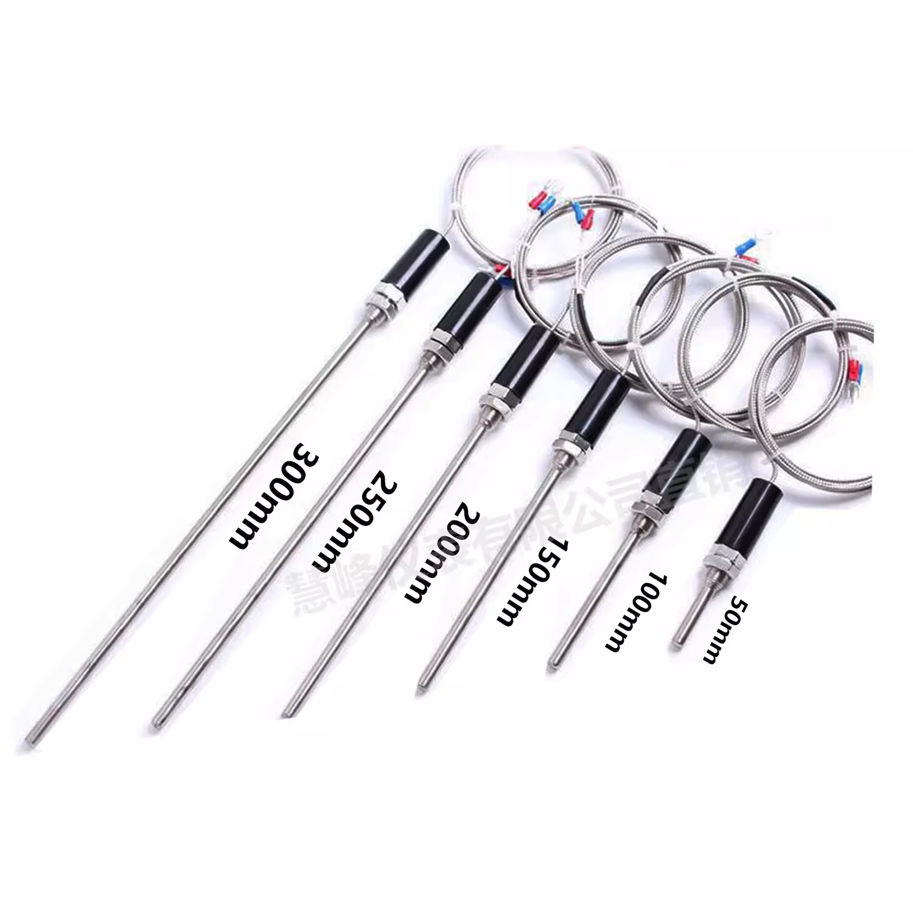
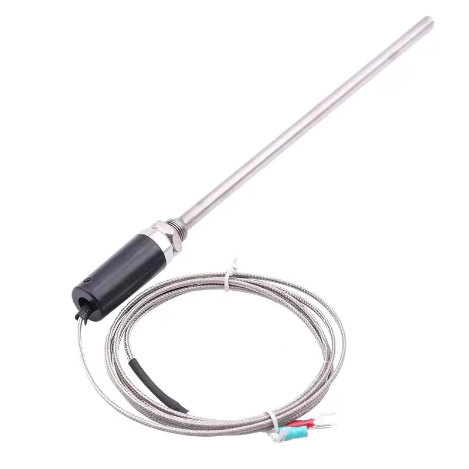
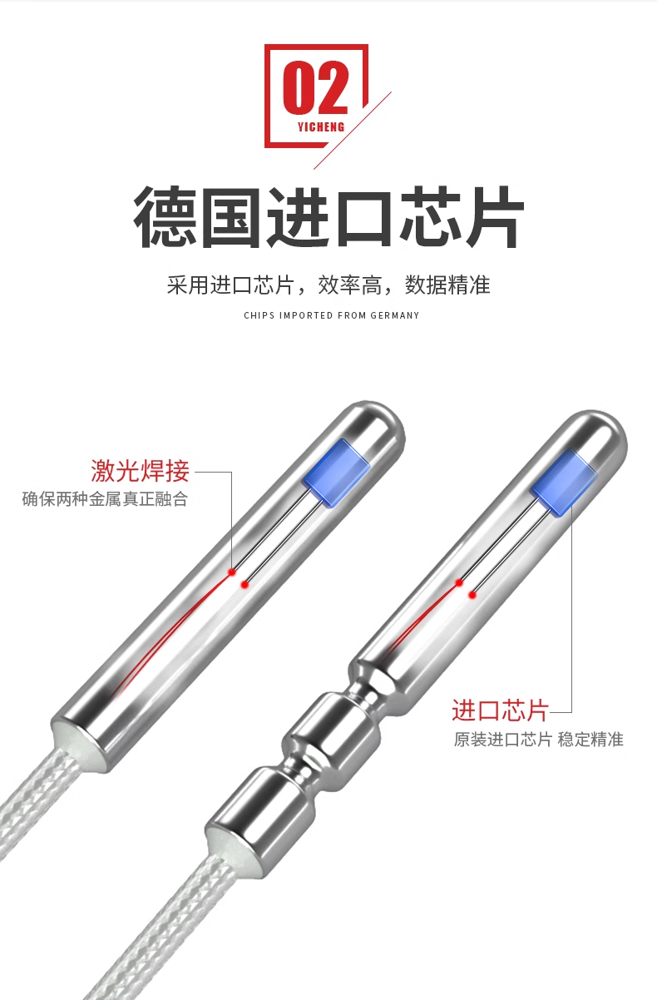
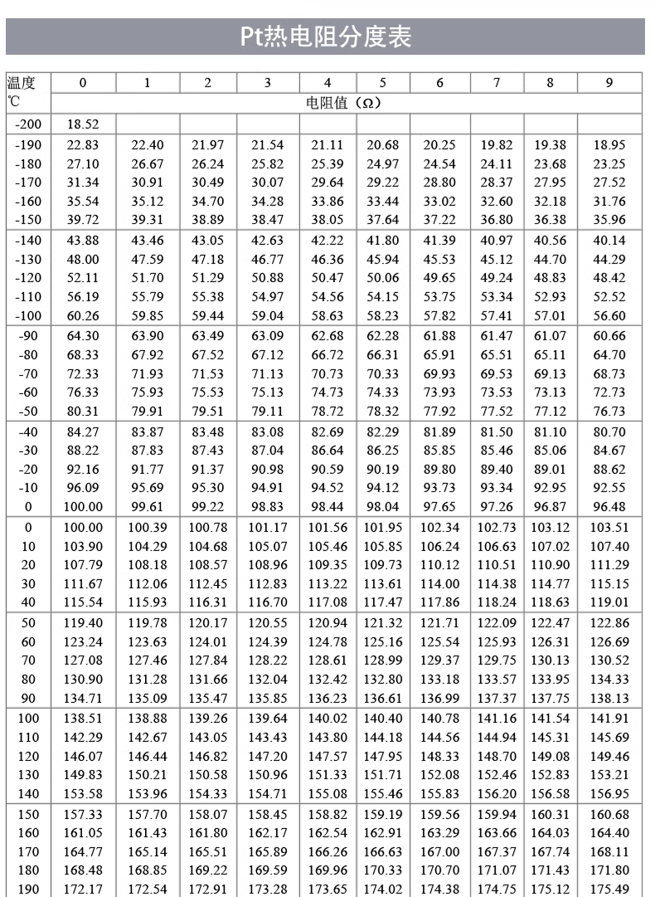
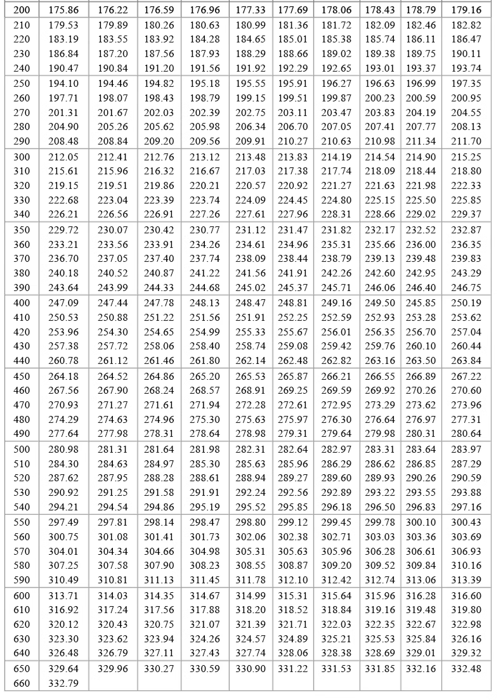
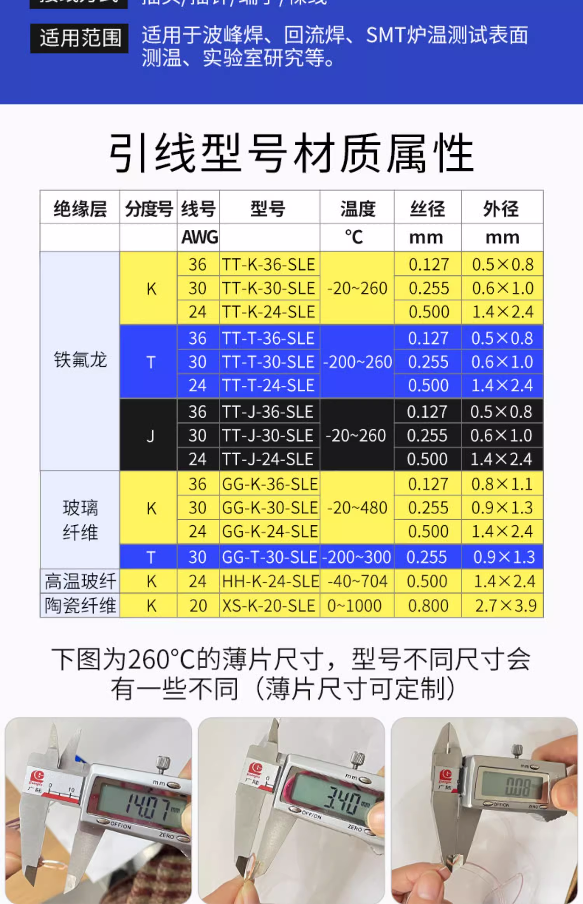

# thermocouple-dat

## common types of thermocouple

| Type   | Sensing Temperature |
| ------ | ------------------- |
| E type | 0~400 C             |
| K type | 0~600 C             |
| CU50   | -50~150 C           |
| PT100  | -50~200 C           |

## params

- rod length 50/100/150/200/250/300 mm
- cable length 1/3/5 meter
- sensor type E/K/CU50/PT100
- connection type 

## PT thermocouple 

## film type thermocouple 

## high-temperature applications 

- high-temp oven 
- coffee machine 
- reflow machine
- heat-tube core machine 

## ref

- [[STH1031-dat]]

- [[MOT1013-dat]]

- [[MAX31855-dat]] - [[MAX6675-dat]]

- [[thermocouple]]
