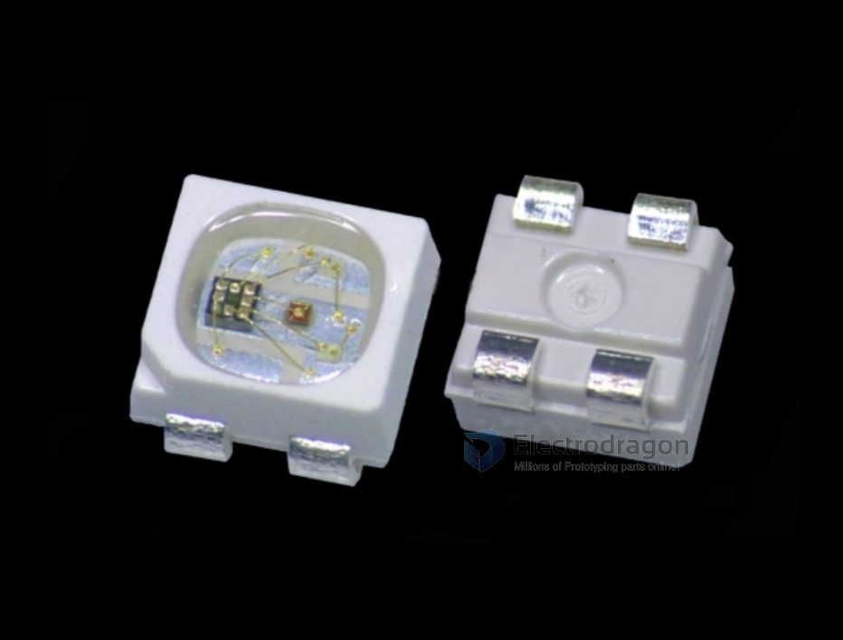

# WS2812 dat 

- legacy wiki page - https://www.electrodragon.com/w/W2812

## Our Boards 

- [[NWI1124-dat]] - [[NWI1126-dat]]

- [[ILE1001-dat]] - [[ILE1047-dat]]

- [[ILE1062-dat]]

## Note 

- WS2812 - ESP32 IO36

## LEDS

- VDD Power Supply
- DOUT Data Out 
- VSS  Ground 
- DIN Data In 

## ref 

- [[led-strip-dat]] - [[ws2812-dat]]