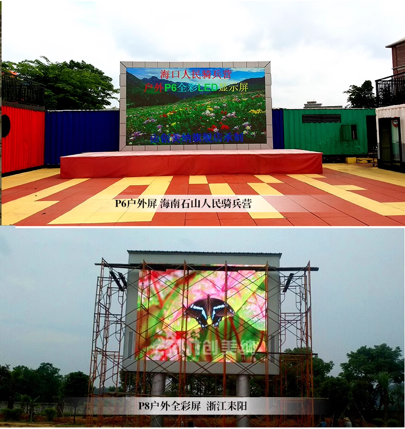
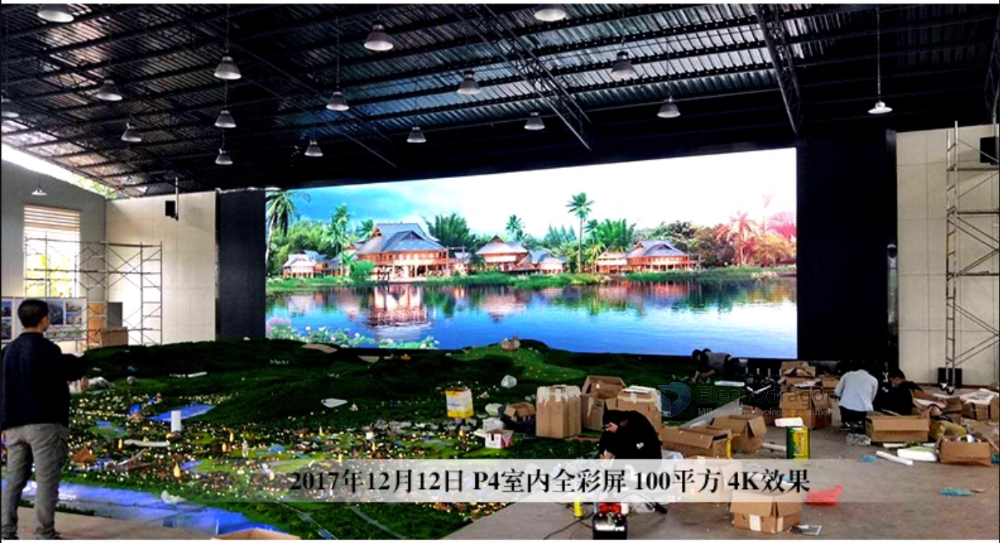
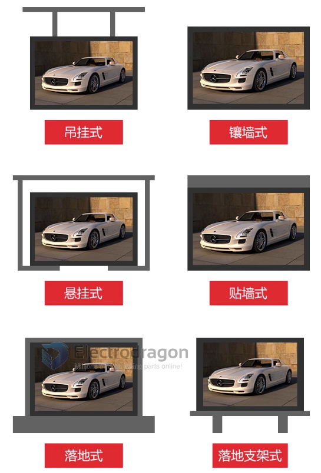

# full panel installation 

## Full Rack Design 

- To install as a full screen:
- For DIY entry level, install the magnetic screws on the panel, and snap to a standard size aluminium profile rack, panel back side support 10~20 screws, strong magnetic screws can hold it, and you can decide how many screws to use.
- https://www.google.co.jp/search?q=aluminium+profile+rack&safe=off&dcr=0&source=lnms&tbm=isch&sa=X&ved=0ahUKEwjtzP7Lnr3WAhVGvLwKHXWbASkQ_AUICigB&biw=1920&bih=950

## Install Methods 

