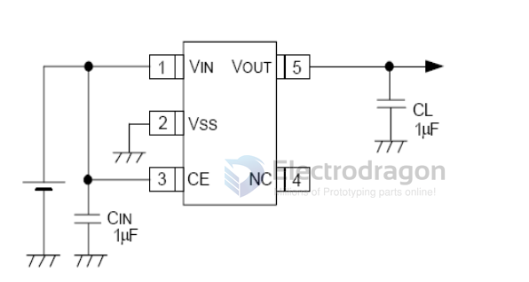
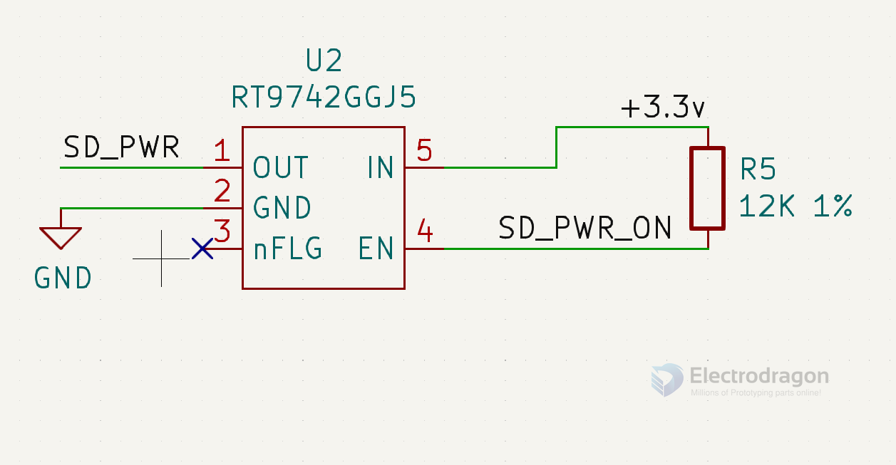

# LDO-dat 

## 6211 

- 6211
- SPX3819
- RT9013 / RT9193
- SGM2028 / SGM2019
- MIC5219
- XC6219
- LP2985

1 - VIN
2 - GND
3 - EN
4 - BYP
5 - VOUT

## 9742 

## option 231 

18V, Low Power, 
High Accuracy, High PSRR LDO Regulators
Maximum Output Current: 500mA

## ref 

- [[LDO]]

- [[silergy]]