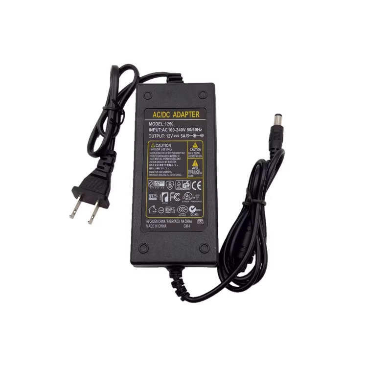

# acdc adapter dat 

## Technical Parameters:
- Input voltage: AC (AC) 100-240V~50/60Hz
- Output voltage: DC (direct current) 12V
- Output current: DC (direct current) 5A
- Input AC line: 0.5m
- Output DC line: 1 meter
- Output DC interface: 5.5*2.5mm [compatible with 5.5*2.1mm]
- Polarity of power supply: positive inside and negative outside, inside (∩outside) (one) (large quantity and special polarity can be ordered as required)
- Power supply size: length 11.8 width 5.2 height 3.1CM
- Packing: transparent pp bag/white carton (transparent pp bag packaging/100 pcs per box by default)

https://item.taobao.com/item.htm?spm=a21n57.1.0.0.718c523cteZiZt&id=522130135676&ns=1&abbucket=6#detail

