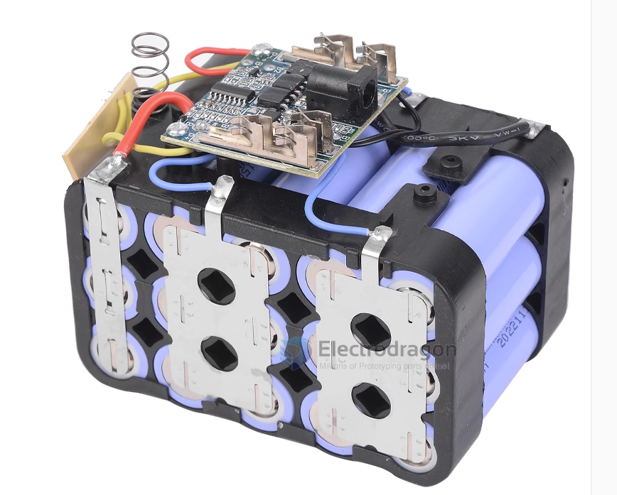

# battery-dat 

## coin battery dat 

CR2030 provides up to 3V 210~225 mAh, and CR1220 provides up to 3V 38mAh power.

Both button cells provide very low discharge rate that can work for 1-3 years.

## Power battery 

