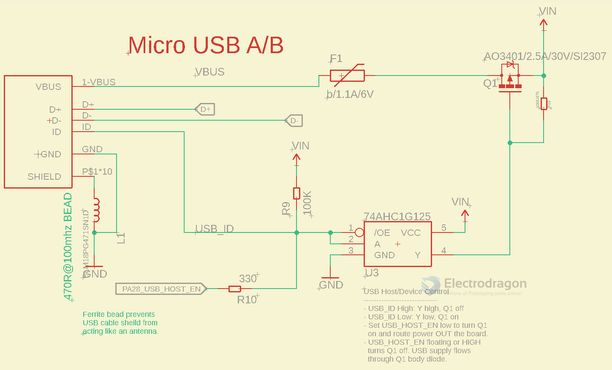

# power-flow-contro-dat

#### USB Logic control for [[SDR1096-DAT]]

[[logic-gate-dat]]

- OE stay off by pull up resistor (default)
- OE turn on by **USB_ID or PA28_USB_HOST_EN pull down**
  - **USB_ID or PA28_USB_HOST_EN pull down** further turn on [[mos-p]]
  - VBUS -> VIN via [[mos-p]] (default off by pull up resistor)

