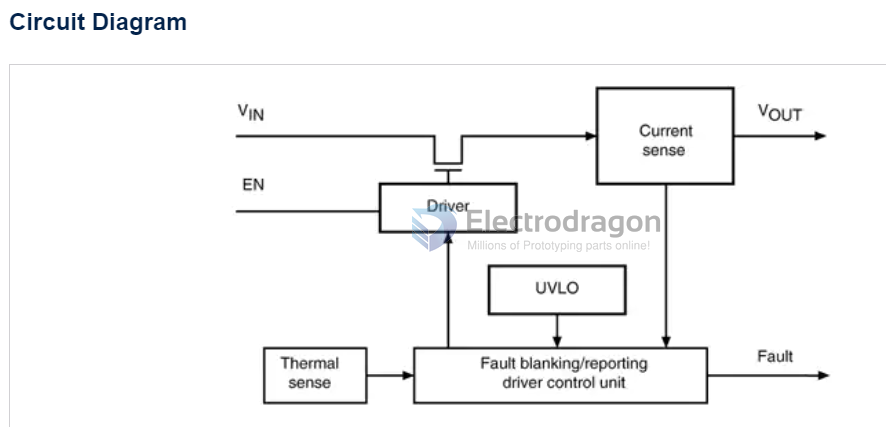

# power-switch-dat

### STMPS2151

Enhanced single channel power switches

- https://www.st.com/en/switches-and-multiplexers/stmps2151.html

All features
- 90 mΩ high-side MOSFET switch
- 500/1000 mA continuous current
- Thermal and short-circuit protection with overcurrent logic output
- Operating range from 2.7 to 5.5 V
- CMOS and TTL compatible enable input
- Undervoltage lockout (UVLO)

### VN750

- [[VN750-dat]]

## ref 

- [[power-switch]] 