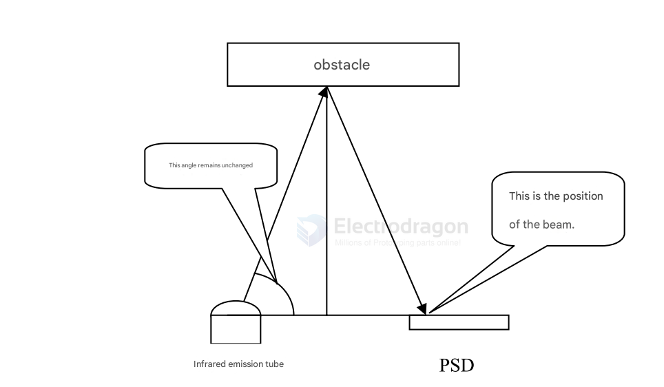

# IR-distance-measurer-dat

based on [[infrared-dat]] tech

My understanding of the working principle of the [[GP2D12-dat]] is as follows (for reference only, corrections are welcome):

It consists of an infrared emitting diode, a PSD (Position Sensing Device), and corresponding calculation circuitry. Sharp's PSD is quite unique; it can detect minute displacements of a light spot falling on it, with a resolution reaching micrometers. The GP2D12 utilizes this characteristic to achieve distance measurement through geometric means.

The light beam emitted by the infrared emitting diode encounters an obstacle and is reflected back, falling onto the PSD. This forms an isosceles triangle. With the help of the PSD, the base of the triangle can be measured. The two base angles are fixed, determined by the emitting diode. At this point, the height of the triangle, which is the distance we want, can be calculated from the base. As shown in the figure below:

From the figure, it can be seen that this is an isosceles triangle with a very acute apex angle. The base is only 2cm, while the height needs to be 10 – 80cm. Therefore, the resolution of the PSD must be extremely high; otherwise, even a tiny deviation will lead to a huge error in the distance measurement. From this point, it can also be concluded that its distance measurement results are difficult to stabilize and make precise, as the ratio is too large.

Because the size of the PSD is limited, it is easy to understand from the figure why its measurement data becomes invalid when the distance is out of range; even a trend cannot be obtained.

From the description of the principle above, it can also be known that it is not a continuous measurement. After obtaining the length of the base, it must be calculated to get the distance value, which is then converted into an analog signal output.

These two inferences are corroborated in the "Sharp GP2D12 applicationNote." Specifically, this is manifested in its strong directionality of distance measurement and the uncertainty of its output (noise up to 200mV, which is 5% relative to the 2.4V full-scale output). This article seems to have been written by an enthusiast abroad who conducted extensive tests, which is extremely helpful for users to understand the performance of the GP2D12 and use it reasonably.

## ref 

- [[infrared-dat]]