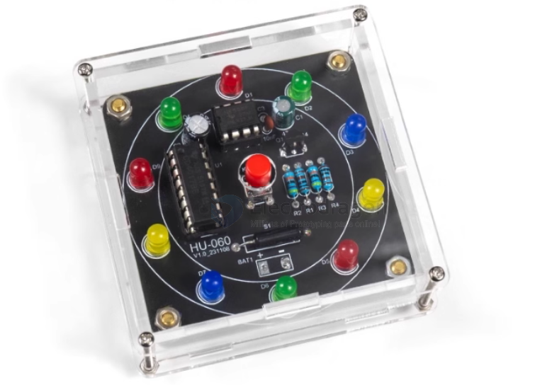
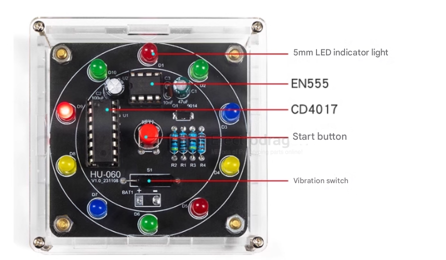

# Lucky-Wheel-dat

## Description

This kit arranges 10 LEDs in a circle. When you press the button, each LED lights up in sequence, spinning quickly at first and then gradually slowing down. Eventually, the spinning stops and one LED remains lit. If the final lit LED matches the player's prediction, it means "winning".

You can assign numbers 1–10 to different items or tasks. The number corresponding to the final lit LED represents the selected item or task. This kit can also be used for guessing games, electronic dice, lottery machines, etc.

## Working Principle

The kit uses NE555 and CD4017 chips to randomly control the LED output. The control can be triggered by a button or a vibration switch. Simply press the button or shake the device, and the LEDs will start spinning. After a while, the spinning stops and only one LED remains lit.

## ref 

- [[training-board-dat]]