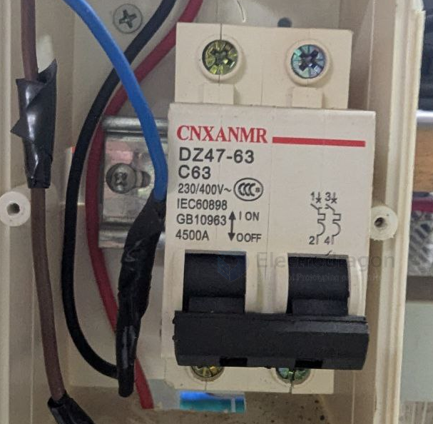

# MCB-dat

miniature circuit breaker (MCB) is a type of electrical switch that automatically switches off electrical circuits in the event of an overload or short circuit. It is designed to protect electrical circuits from damage caused by excessive current flow.

From the picture, you can see:

1. The device model is identified as "CNXANMR DZ47-63 C63"
2. Specifications are marked "230/400V~" (indicating rated voltage)
3. "IEC60898" (International Electrotechnical Standard)
4. "GB10963" (Chinese National Standard)
5. "100A-4500A" (may indicate rated current range or breaking capacity)
6. There is an ON/OFF switch, currently in the ON position

This is a device used for circuit protection. It automatically cuts off the circuit when an overload or short circuit occurs, protecting electrical equipment and personal safety. DZ47-63 is a common model of miniature circuit breaker, and C63 indicates its rated current is 63 amperes.

This type of circuit breaker is very common in low-voltage power distribution systems in China and many other countries.
This is a miniature circuit breaker (MCB), model DZ47-63 C63. It is used for circuit protection and automatically disconnects when the current exceeds safe limits, preventing electrical fires and equipment damage.

Main parameters:

- Brand: CNXANMR
- Model: DZ47-63 C63
- Rated voltage: 230/400V~
- Complies with standards: IEC60898 and GB10963 (Chinese National Standard)
- Rated current: 63A
- Breaking capacity: 4500A

This type of circuit breaker is commonly used in residential, commercial, and industrial electrical systems as a circuit protection device. In the picture, it can be seen installed in a distribution box, connected to blue, red, and black wires.

## ref 

- [[MCB]] - [[app]]

