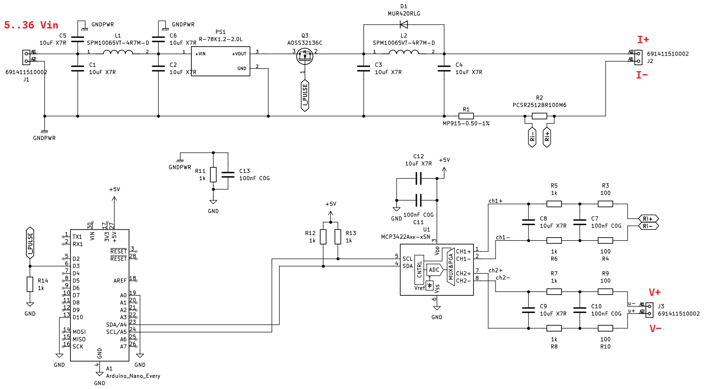
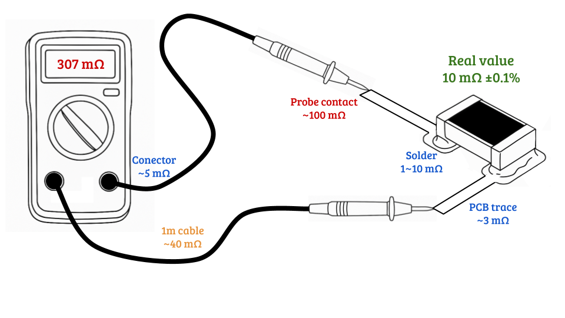
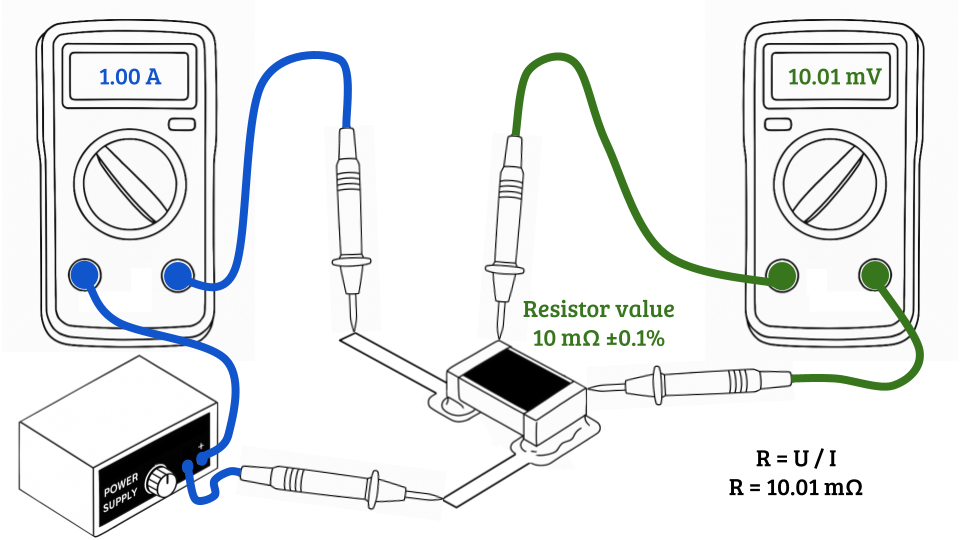
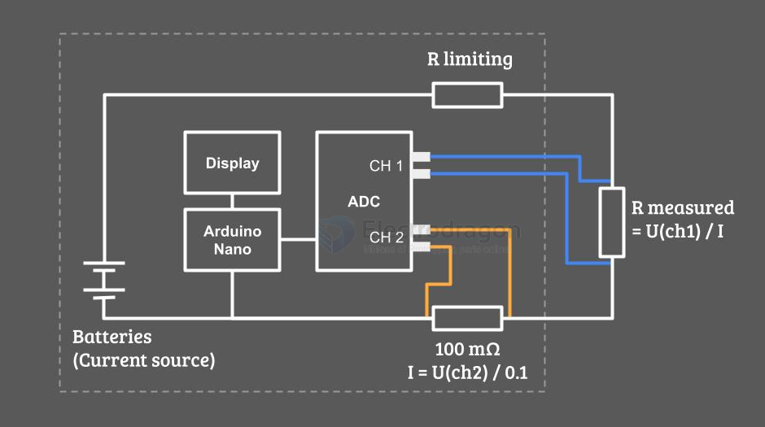

# Micro-Ohmmeter-dat

- [[Micro-Ohmmeter-dat]] - [[app-dat]]

- [[meter-internal-resistance-dat]] - [[meter-resistance-dat]] - [[meter-dat]] 

- [[Kelvin-Clamp-dat]]

## SCH 

## 2-wire setup 

## 4-wire setup 

## design simplified 

## ref 

https://hackaday.io/project/203648-lysvolt-microohm-4-wire-precision-ohmmeter

https://www.servomagazine.com/magazine/article/build-a-simple-micro-ohmmeter

