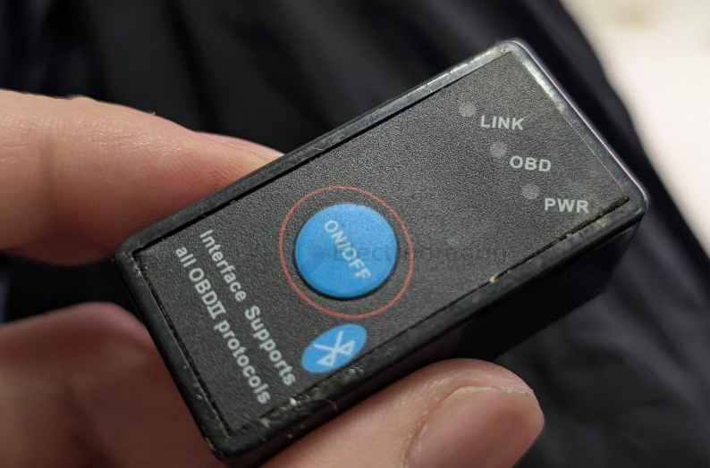
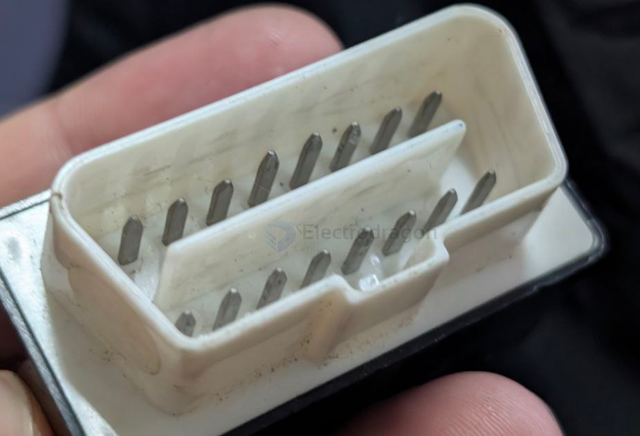
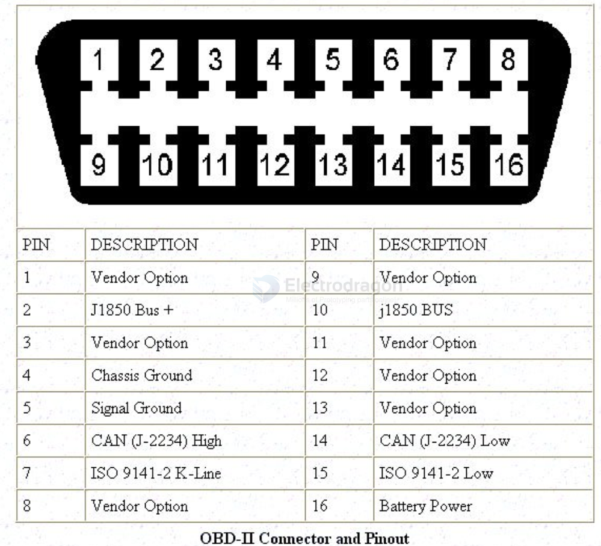
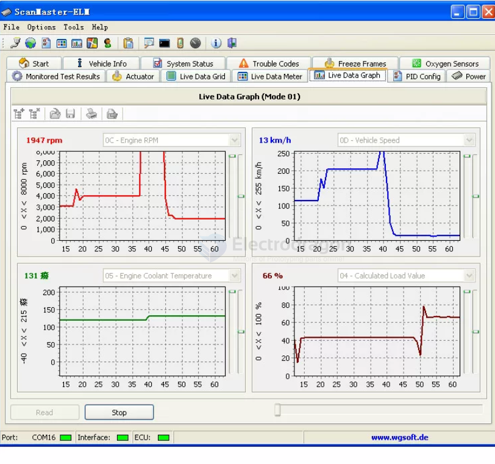

# OBD-dat

https://github.com/Edragon/OBD == Repository unavailable due to DMCA takedown.

- [[CAN-dat]] - [[K-line-dat]] - [[OBD-dat]]

- ELM327

- scanmaster ELM 

OBD-II Pinout (SAE J1962 Connector)

| PIN | DESCRIPTION       |       |
| --- | ----------------- | ----- |
| 1   | `Vendor Option`   |       |
| 2   | J1850 Bus +       |       |
| 3   | `Vendor Option`   |       |
| 4   | Chassis Ground    | Power |
| 5   | Signal Ground     | Power |
| 6   | CAN (J-2234) High |       |
| 7   | ISO 9141-2K-Line  |       |
| 8   | `Vendor Option`   |       |
| 9   | `Vendor Option`   |       |
| 10  | J1850 BUS         |       |
| 11  | `Vendor Option`   |       |
| 12  | `Vendor Option`   |       |
| 13  | `Vendor Option`   |       |
| 14  | CAN (J-2234) Low  |       |
| 15  | ISO9141-2Low      |       |
| 16  | Battery Power     | Power |

OBD stands for On-Board Diagnostics. It's a system in modern vehicles that monitors the engine and other vehicle systems. When it detects a problem, it turns on the "check engine" or "service engine soon" light on your dashboard and stores a diagnostic trouble code (DTC) that identifies the issue. This helps technicians diagnose and repair problems more easily.

## the pins in the OBD-II connector related to J1850 are:

- [[J1850-dat]] - [[SAEJ1850-dat]]

Pin 2 (SAE J1850 Bus+): Carries the signal for both PWM and VPW protocols.
Pin 10 (SAE J1850 Bus-): Used only for the PWM protocol (Ford).

## ref 

- [[CAN-dat]] 
