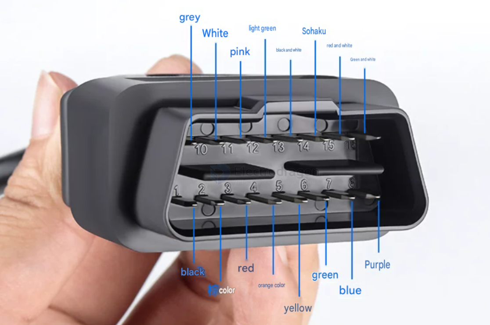

# OBD-dat

- [[OBD-dat]] - [[car-dat]] - [[app-dat]] - [[battery-Lead-acid-dat]] - [[Cigarette-Lighter-dat]] - [[OPM1181-dat]]

https://github.com/Edragon/OBD == Repository unavailable due to DMCA takedown.

- [[CAN-dat]] - [[K-line-dat]] - [[OBD-dat]]

- ELM327

- scanmaster ELM / torque (apk apps)

## function 

- examine the enginee's error code 

## interface 

OBD-II Pinout (SAE J1962 Connector)

power pin 4 ground + pin 16 +12V

| PIN | DESCRIPTION       |       |
| --- | ----------------- | ----- |
| 1   | `Vendor Option`   |       |
| 2   | J1850 Bus +       |       |
| 3   | `Vendor Option`   |       |
| 4   | Chassis Ground    | Power |
| 5   | Signal Ground     | Power |
| 6   | CAN (J-2234) High |       |
| 7   | ISO 9141-2K-Line  |       |
| 8   | `Vendor Option`   |       |
| 9   | `Vendor Option`   |       |
| 10  | J1850 BUS         |       |
| 11  | `Vendor Option`   |       |
| 12  | `Vendor Option`   |       |
| 13  | `Vendor Option`   |       |
| 14  | CAN (J-2234) Low  |       |
| 15  | ISO9141-2Low      |       |
| 16  | Battery Power     | Power |

OBD stands for On-Board Diagnostics. It's a system in modern vehicles that monitors the engine and other vehicle systems. When it detects a problem, it turns on the "check engine" or "service engine soon" light on your dashboard and stores a diagnostic trouble code (DTC) that identifies the issue. This helps technicians diagnose and repair problems more easily.

## the pins in the OBD-II connector related to J1850 are:

- [[J1850-dat]] - [[SAEJ1850-dat]]

Pin 2 (SAE J1850 Bus+): Carries the signal for both PWM and VPW protocols.
Pin 10 (SAE J1850 Bus-): Used only for the PWM protocol (Ford).

## why not good for charging 

## Part 1: Can the OBD Port Charge an External Lead-Acid Battery?

**Short Answer:** Technically possible, but **highly discouraged** due to severe safety risks, low efficiency, and the potential for expensive electrical damage.

The **Pin 16** of a standard OBD (On-Board Diagnostics) interface is directly tied to the positive terminal of the car battery, providing a constant 12V supply. Because the circuit is bi-directional, electricity can theoretically flow both ways. However, trying to charge an external battery through it introduces major problems:

### 1. Risk of Blown Fuses (Current Limits)
* **Low Threshold:** OBD ports are designed for low-power diagnostic tools, GPS trackers, or dashcams. The corresponding fuse for the OBD port is usually rated for only **5A to 7.5A** (rarely 10A).
* **High Inrush Current:** A depleted external lead-acid battery will demand a massive amount of current when first connected. This spike will instantly exceed 5A and **blow the car's OBD fuse**.

### 2. Voltage Drop & Incomplete Charging
* **Alternator Output:** When the car engine is running, the alternator outputs around $13.5\text{V} - 14.5\text{V}$, which is technically enough to charge a 12V lead-acid battery.
* **Line Loss:** Because OBD wiring uses very thin gauge wire, significant voltage drop occurs over the distance of the harness. The voltage reaching the end of the line will be too low to ever fully top off the external battery.
* **Engine Off Scenario:** If the car is off, connecting the batteries directly just creates a parallel connection. Current will flow from the higher voltage battery to the lower one until they balance out, likely **draining your car's main starter battery**.

### 3. Potential ECU/Car Computer Damage
The OBD port is directly tied to the vehicle's communication buses and sensitive Electronic Control Units (ECUs). Routing un-stabilized, high-current power through this port risks causing voltage surges or short circuits that can **fry the car's main computer modules**, leading to incredibly high repair bills.

## connection and demo 

https://t.me/electrodragon3/440

## ref 

- [[CAN-dat]] 
