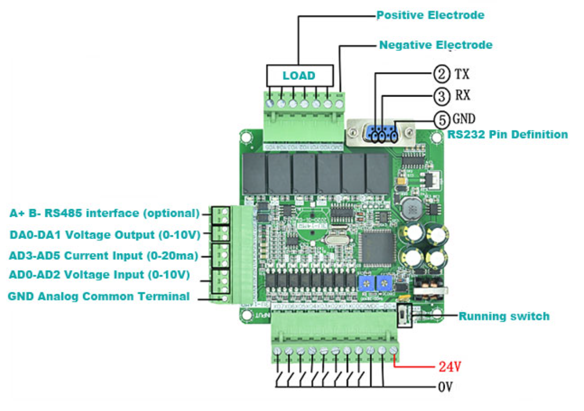

# PLC-dat

- [[PLC-dat]] - [[modbus-dat]]  - [[RTU-dat]] 

In the dynamic landscape of industrial automation, having a reliable `Programmable Logic Controller (PLC)` is paramount. 

## tech 

- [[relay-dat]] - [[optical-coupler-dat]] - [[input-dat]] - [[output-dat]] - [[analog-dat]] - [[digital-dat]] - [[HMI-dat]] - [[ADC-dat]] - [[RS485-dat]] - [[RS232-dat]] - [[power-dat]] - [[24V-dat]] - [[ethernet-dat]] - [[network-dat]] 

- [[peripherals-dat]]

- [[current-loop-transmitter-dat]] - [[current-loop-receiver-dat]] - [[ITF1003-DAT]] - [[industrial-measurement-dat]] - [[transmitter-current-dat]]

## apps 

## about PLC

PLC (Programmable Logic Controller) is a digital computer used for automation of electromechanical processes, such as control of machinery on factory assembly lines, amusement rides, or light fixtures.

**PLC** stands for **Programmable Logic Controller**.

## Definition
A **PLC** is an **industrial digital computer** designed to control manufacturing processes or machinery. It is widely used in **automation** to monitor inputs, make logic-based decisions, and control outputs.

## Key Characteristics
- **Programmable**: Custom logic can be created using ladder logic, function blocks, or structured text.
- **Reliable and Rugged**: Designed for harsh industrial environments (dust, heat, vibration).
- **Real-Time Control**: Monitors sensors (inputs) and controls actuators (outputs) in real time.

## Typical Applications
- Assembly lines
- Packaging machines
- Robotics
- Elevator control systems
- Water treatment plants

## Example
A PLC might:
1. Receive a signal from a **temperature sensor**.
2. Compare it to a threshold.
3. If it’s too high, activate a **cooling fan** using a relay output.

## ref 

- [[motion-controller-dat]]

