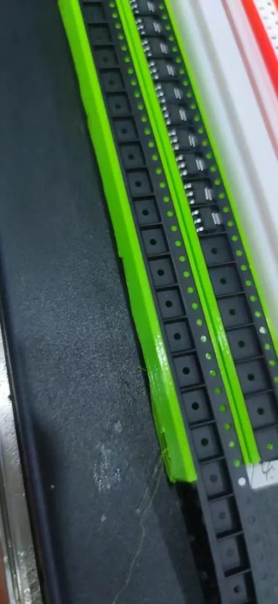

# Loose-Component-Taping-Feeder-dat

## Look like 

This method can be used for components that are placed infrequently in a single run, for example, if a single board only has one or two of these components.

## How to use

The usage rules for the latest version have been updated to obtain the center position of the component.
