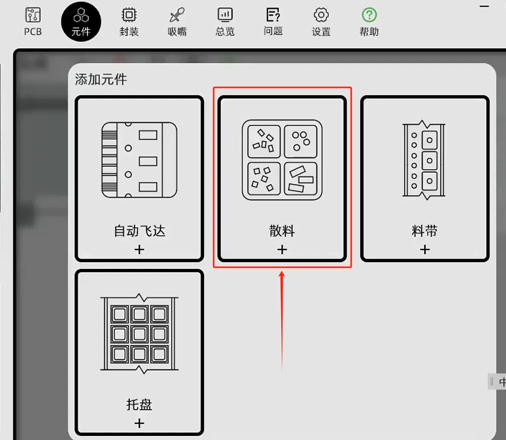
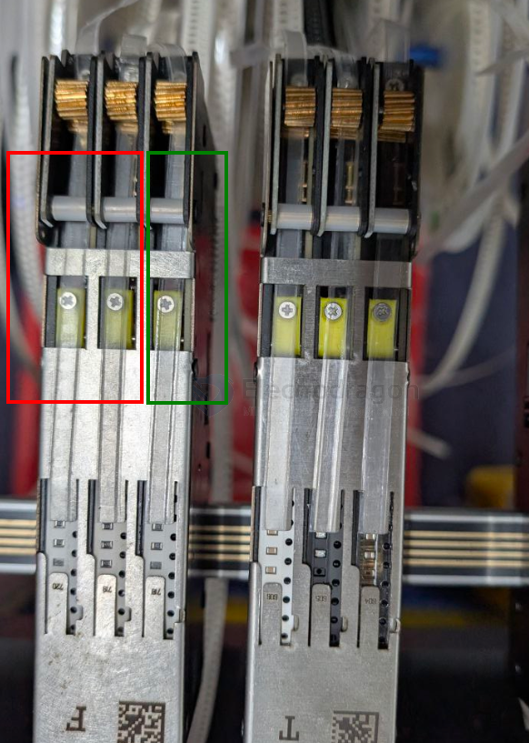

# feeder-dat

## feeder types 

- [[feeder-electric-auto-dat]] - target for - [[SMD-tape-reel-dat]] w/reel
- [[feeder-loose-component-dat]] - target for - [[SMD-tape-reel-dat]] w/o tape and reel, bare components only 
- [[feeder-loose-component-taping-dat]] - [[SMD-tape-reel-dat]] w/o reel
- [[feeder-tray-dat]] - large size [[PCB-footprint-dat]]

- [[feeder-electric-auto-dat]] parts: [[feeder-tray-dat]]

## other Type of Feeder Info 

https://github.com/opulo-inc/feeder

Photon is Open-Source firmware for pick and place feeders.

https://github.com/photonfirmware/photon

## setup the feeder 

stripe shoule go under the metal piece as correct as the green box shown below 

green part work as a "button" to tell the machine rolling the tape

## ref 

- [[pnp-machine-dat]]

- [[feeder]]