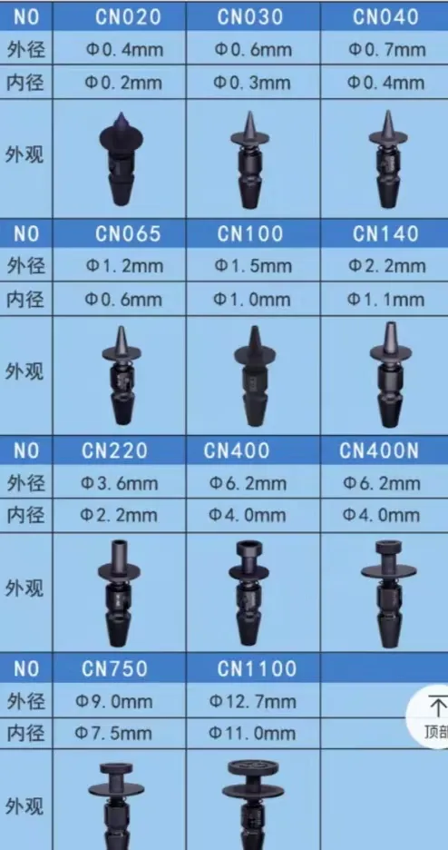

# nozzle-dat

- [[fitting-dat]] - [[mechanism-dat]]

## spray nozzle

- tube locker 

## 3D printer nozzle

M6 outter thread

## PCB nozzole 

| Nozzle | Application                                                        |
| ------ | ------------------------------------------------------------------ |
| CN030   | 0201, 0402 and components of similar size                          |
| CN040   | 0402, 0603 and components of similar size                          |
| CN065   | 0603, 0805, SOT23 and components of similar size                   |
| CN100  | 0603, 0805, 1206, SOT23, SOP8 and components of similar size       |
| CN140  | SOP8, SMA cap and components of similar size                       |
| CN220  | SOP8, SOP16, SMA CAP, QFP32 and components of similar size         |
| CN400  | SOP16, QFP32, QFP64, QFP100, QFP144 and components of similar size |
| CN600  | QFP32, QFP64, QFP100, QFP144 and components of similar size         |
| CN800  | QFP100, QFP144, QFP208 and components of similar size               |

## ref 

- [[PNP-machine-dat]]

- [[nozzle]]
