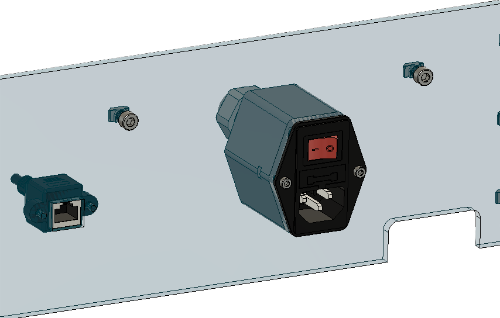

# PixiePlacer-frames-back-panel-dat

The Back_Panel_Cover covers the back of the machine. Power via the Power_Socket and internet via RJ45_Panel_Mount is supplied to the machine. Mount theBack_Panel_Cover with 2x Socket_Cap_Screw_M3x20mm and 2x M3_Nut.

