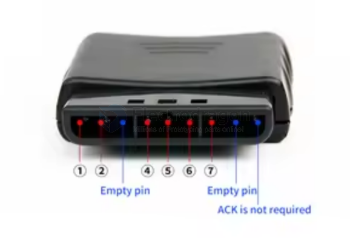

# PS2-console-dat

- [[NWL1093-dat]] - [[NWL1097-dat]] - [[PS2-console-dat]]

## Pin Definitions 

| No. | Pins   | PS2 Name | Note                                                                                                                                                                                                                                              |
| --- | ------ | -------- | ------------------------------------------------------------------------------------------------------------------------------------------------------------------------------------------------------------------------------------------------- |
| 1   | DI/DAT | DAT      | The handle sends a command to the master, This signal is an 8-bit serial data, which is synchronously transmitted on the falling edge of the clock. The reading of the signal is completed in the process of changing the clock from high to low, |
| 2   | DO/CMD | CMD      | The master receiwes the data sent by the handle, This signal is an 8-bit serial data, which is synchronously transmitted on the falling edge of the cliock.                                                                                       |
| 3   | empty  | Vibr     | NC                                                                                                                                                                                                                                                |
| 4   | GND    |          | Ground                                                                                                                                                                                                                                            |
| 5   | VDD    |          | Receiver working voltage is 3V.                                                                                                                                                                                                                   |
| 6   | CS/SEL | Attn     | Handle trigger signal. During communication, it is at low level.                                                                                                                                                                                  |
| 7   | CLK    |          | Clock signal, sent by the master.                                                                                                                                                                                                                 |
| 8   | empty  |          | NC                                                                                                                                                                                                                                                |
| 9   | ACK    |          | NC                                                                                                                                                                                                                                                |

## repo code 

[Support Arduino-PS2X library.](https://github.com/madsci1016/Arduino-PS2X)

- folk - https://github.com/Edragon/Arduino-PS2X

## code debug 

****************IF YOU HAVE PROBLEMS***********************

open up the PS2X_lib.h file and change (remove the comment markers)

    // $$$$$$$$$$$$ DEBUG ENABLE SECTION $$$$$$$$$$$$$$$$
    // to debug ps2 controller, uncomment these two lines to print out debug to uart

    //#define PS2X_DEBUG
    //#define PS2X_COM_DEBUG

to 

    // $$$$$$$$$$$$ DEBUG ENABLE SECTION $$$$$$$$$$$$$$$$
    // to debug ps2 controller, uncomment these two lines to print out debug to uart

    #define PS2X_DEBUG
    #define PS2X_COM_DEBUG
