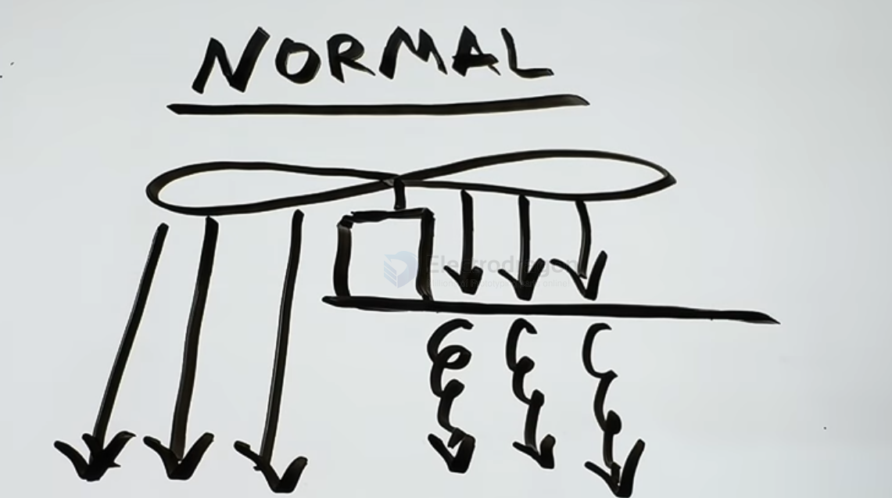
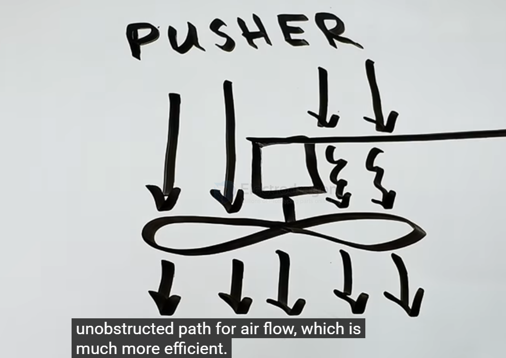

# FPV-frame-pusher-dat

up-side down pusher frame

- [[FPV-frame-pusher-dat]] - [[FPV-frame-dat]] 

- [[FPV-propeller-dat]] - [[FPV-propeller-bi-dat]]

## tech 

- [[fab-3d-print-dat]] - [[PETG-dat]] == strong materials 

## frame 

3D model: 65mm LR Frame - https://cad.onshape.com/documents/a13bc3ae3de0482b4a2ccfc2/w/7922fdd2b2fc287f4aca4314/e/c2938ebf99e88d0d273953ea

## normal 

## pusher 

## ref 

https://www.youtube.com/redirect?event=video_description&redir_token=QUZZTVljRVZrWV9jaDk1eTBFaW1EQVpOeVpxTnxBTl9pYzRmczlRaEV1dXhydGNnaDBvZERpSV94VEJSN0UzTHBRbFFLNmFOQ212a1kyWFdZb0hmY3M3d29WRTRiMGxKZ0JUXzhMeXg4VmpKS2xlRldLcTRCWUlTUHpGUWNwVEJw&q=https%3A%2F%2Fcad.onshape.com%2Fdocuments%2Fa13bc3ae3de0482b4a2ccfc2%2Fw%2F7922fdd2b2fc287f4aca4314%2Fe%2Fc2938ebf99e88d0d273953ea&v=gvf1hfomu-A