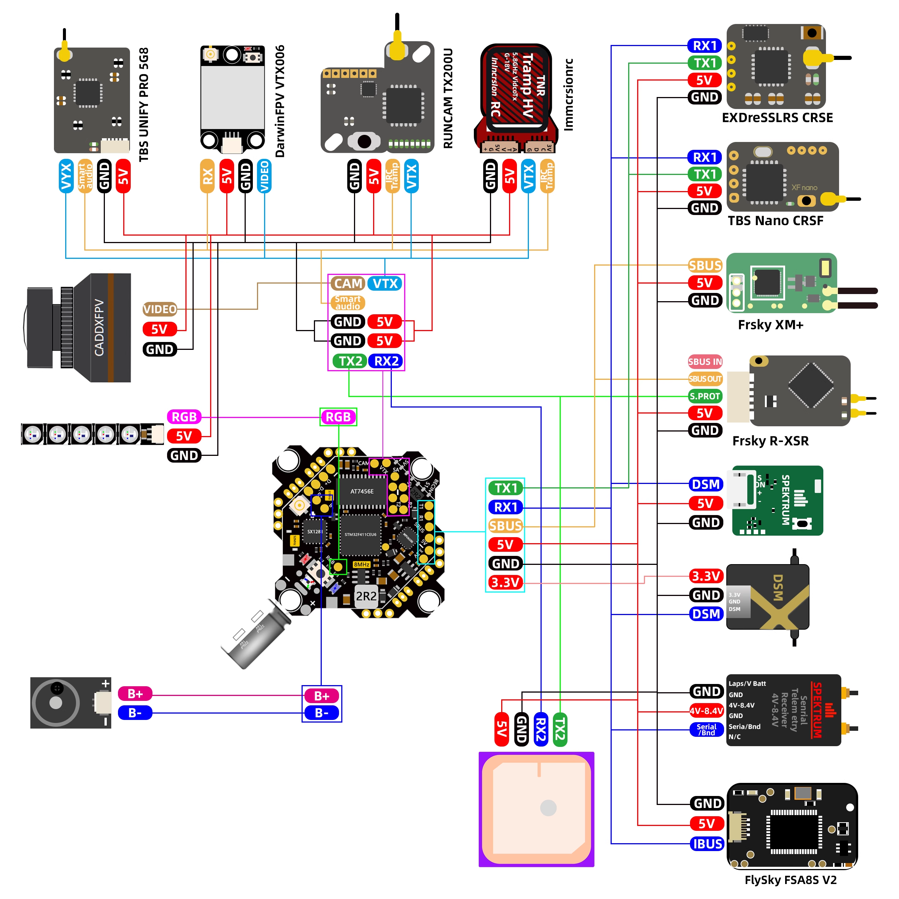

# FPV-wiring-dat

- [[FPV-wiring-dat]] - [[FPV-build-dat]] - [[flight-controller-dat]] - [[FUS-X111-dat]]

- [[VTX-dat]] - [[OSD-dat]] - [[flight-controller-dat]]

1. FPV Camera
   
VIN: Connect to Camera Video Out / Signal (Video In to FC).

5V: Connect to Camera Power (+5V).

GND: Connect to Camera Ground.

2. Analog Video Transmitter (VTX)
   
VOUT: Connect to VTX Video In (FC output with Betaflight OSD overlay).

TX1: Connect to VTX SmartAudio or IRC Tramp control wire (for changing channels/power in OSD).

5V: Connect to VTX Power Input.

GND: Connect to VTX Ground.

3. Receiver (ELRS / Crossfire)

Because UART1 (TX1/RX1) is being shared with the VTX telemetry on this cluster, you have two wiring approaches:

If using UART1 for Receiver:

RX1: Connect to Receiver TX

TX1: Connect to Receiver RX

5V / GND: Receiver Power and Ground

(Note: In this case, you won't connect the VTX SmartAudio wire to TX1 as UART1 is dedicated to the RX).

If using SBUS Receiver:

Connect the Receiver signal line to the inverted SBUS/RX1 pad.

LED: Connect to Smart RGB LED Strip (WS2812 data line).

BZ- / 5V: Connect an active 5V Buzzer (BZ- triggers the ground line, 5V powers it).

## FC AIO = flight controller all in one

## ref 

