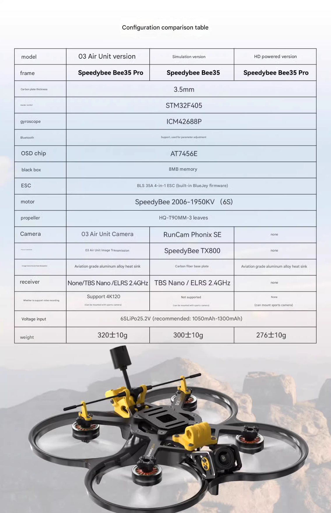
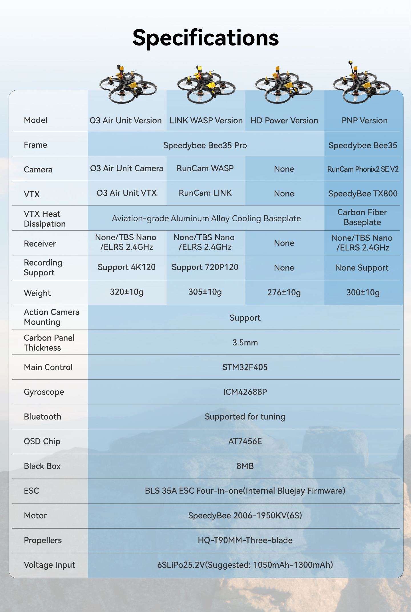

# FPV-dat

- [[mobula8-dat]]  

- [[FPV-dat]] - [[whoop-dat]]

- [[FPV-size-dat]] - [[FPV-mode-dat]] - [[FPV-load-dat]] 

- [[camera-FPV-dat]] - [[camera-FPV-angle-dat]]

- [[fixed-wing-dat]] - [[FPV-dat]] - [[flight-simulation-dat]]

- [[FPV-build-dat]] - [[battery-FPV-dat]]

## Info 

穿越机`（英文名称：FPV Drone，全称 First Person View Drone）`是一种通过佩戴 FPV 飞行眼镜，以第一人称视角进行实时操控的高性能无人机。

与普通航拍无人机不同，穿越机追求极高的速度、灵活性与操控自由度，常用于竞速比赛、花式飞行（Freestyle）以及沉浸式影视拍摄。

核心特点与区别

`第一人称视距`：飞手通过无线图传眼镜实时接收机载摄像头的画面，如同亲坐在机舱驾驶舱内飞行。 - [[FPV-dat]]

`手动模式（Acro Mode）`：大多数穿越机没有 GPS 自动悬停、自主避障或姿态自平功能，完全依靠飞手手动控制电机转速与姿态，可完成翻滚、穿缝、急速俯冲等高难动作。

`高推重比与高速`：拥有极高的推重比（通常在 4:1 到 10:1 以上），零到百公里加速仅需几秒，最高时速可达 140–200 km/h 以上。- [[thrust-to-weight-ratio-dat]]

`DIY 组装与模块化`：玩家通常自行选购机架、飞控（FC）、电调（ESC）、电机、图传（VTX）和接收机进行组装与维修。 - [[flight-controller-dat]] - [[ESC-dat]] - [[motor-dat]] - [[VTX-dat]]

- [[quadcopter-dat]]

- [[ELRS-dat]] - [[FrSky-dat]] - [[ArduPilot-dat]] - [[CRSF-dat]]
  
- [[BMS-dat]] - [[flight-controller-dat]] - [[ESC-dat]] - [[motor-dat]] - [[propeller-dat]]

- [[camera-FPV-dat]] - [[VTX-dat]]

- [[RC-controller-dat]]

- [[FPV]] - [[DJI-dat]] - [[RC-supplier-dat]]

- [[battery-pack-dat]] - [[power-dat]]

- [[sensor-dat]]  - [[motor-dat]] - [[motor-FPV-dat]]

- [[FPV-accesories-dat]]

- [[betaflight-dat]] - [[RC-configurator-dat]]

- [[indoor-fly-dat]] - [[FPV-load-dat]]

- [[CaddxFPV-dat]] - [[DJI-dat]]

- [[conn-dat]] - [[antenna-dat]]

- [[FPV-stability-dat]] - [[FPV-dat]] - [[FPV-control-dat]]

- [[FPV-build-dat]] - [[FPV-frame-dat]] - [[flight-controller-dat]] - [[motor-FPV-dat]] - [[propeller-FPV-dat]] - [[camera-FPV-dat]]

## learning process and Learning Curve

- [[FPV-simulation-dat]] 

- Indoor TinyWhoop → **Hard** (fast reaction, fine control)
- Outdoor 5-inch → **Also hard** (high cost, mental pressure)

The generally accepted practice path:

1. **Simulator** – build muscle memory
2. **Indoor TinyWhoop** – practice fine control; crashes don't hurt the wallet
3. **Outdoor** – more space actually makes it "easier", just be careful

---

### Indoor TinyWhoop vs. Outdoor FPV: Difficulty Comparison

| Aspect           | Indoor TinyWhoop                                  | Outdoor 5-inch                |
| ---------------- | ------------------------------------------------- | ----------------------------- |
| Space            | ❌ Extremely cramped (a few m² room)               | ✅ Open                        |
| Reaction time    | ❌ Milliseconds (wall right in front of you)       | ✅ Generous                    |
| Wind             | ✅ No wind                                         | ❌ Must fight the wind         |
| Inertia          | ❌ Too light – darts forward on stick input        | ✅ Heavy, predictable movement |
| Visual reference | ❌ Complex indoor textures, hard to judge distance | ✅ Open, easy to judge         |
| Crash cost       | ✅ Cheap (tens of RMB)                             | ❌ Expensive (hundreds of RMB) |
| Safety           | ✅ Won't hurt people                               | ❌ Dangerous (large props)     |

---

### Why Is Indoor TinyWhoop Actually Harder?

#### ① Space = Reaction Time

- Outdoor: you see an obstacle → react within **300ms** → enough time
- Indoor: walls/furniture are 1–2m away → must react within **50–100ms** → not enough

At the same speed (3 m/s), outdoor gives you a **10× larger reaction window**. Indoor flying is essentially "threading the needle between obstacles."

#### ② Light Weight Causes "Non-linear" Control

- 50g TinyWhoop: a 20% stick input darts the drone forward, feels floaty
- 500g 5-inch: a 20% stick input produces a gentle change, feels heavy and controllable

Light = responsive = beginners feel "overdone". A TinyWhoop demands extremely delicate stick control.

#### ③ Visual Deception

- Indoor wallpaper/floor textures confuse optical flow and visual references
- Hard to judge distance (ceilings and corners all look the same)
- Easy to get "lost" in first person (you don't know which way you're facing)

---

### But Outdoor Has Its Own Difficulties

| Challenge                        | Notes                                          |
| -------------------------------- | ---------------------------------------------- |
| **Wind**                         | Must fight it (your Mobula8 problem)           |
| **Loss of control consequences** | A crash = total loss; repair costs are high    |
| **Distance / getting lost**      | Fly too far and you may not find your way back |
| **Regulations / safety**         | Can't hit people; high mental pressure         |

## popular whoops 

- [[aquila16]]

- indoor build 65mm - [[mobula6-dat]] - meteor65 

## The best overall FPV drone Starting Kit 

- [[RC-dat]] == [[radiomaster-dat]] = 50 USD

- [[goggles-dat]] == [[walksnail-dat]] = 180 USD

- [[drone-maker-dat]] == [[mobula8-dat]] == [[happymodel-dat]] == 100 USD

- [[betaFPV-dat]] - [[Aquila16-dat]]

## RC configurator 

- [[betaflight-dat]] - [[BLHeli-Configurator-dat]]

- [[FPV-takeoff-checklist-dat]]

## Bee35

| version                    | price | description                           |
| -------------------------- | ----- | ------------------------------------- |
| Bee35 Pro O3 Air Unit TBS  | 480   | O3 Air Unit, TBS radio                |
| Bee35 Pro O3 Air Unit ELRS | 470   | O3 Air Unit, ELRS radio               |
| Bee35 Pro O3 Air Unit PNP  | 460   | O3 Air Unit, no receiver              |
| Bee35 Pro                  | 270   | Standard analog version               |
| Bee35 Pro LINK WASP TBS    | 430   | LINK WASP digital system, TBS radio   |
| Bee35 Pro LINK WASP ELRS   | 420   | LINK WASP digital system, ELRS radio  |
| Bee35 Pro LINK WASP PNP    | 400   | LINK WASP digital system, no receiver |
| Bee35 Analog TBS           | 306   | Analog FPV system, TBS radio          |
| Bee35 Analog ELRS          | 296   | Analog FPV system, ELRS radio         |

## commerialized FPV

- [[speedybee-dat]]

### 1. [SpeedyBee Flight Controllers & Stacks](https://speedybee.com/)
- **Brand:** SpeedyBee  
- **Description:** Budget-friendly, Betaflight-supported flight controllers with easy app-based tuning.  
- **Example Products:**  
  - **SpeedyBee F405 V4 Stack** (F4-based, affordable)  
  - **SpeedyBee F7 V3 Stack** (F7-based, powerful & feature-rich)  
- **Commercial Features:**  
  - Wireless **Bluetooth & Wi-Fi tuning** via SpeedyBee app.  
  - Fully compatible with Betaflight Configurator.  
- **Website:** [speedybee.com](https://speedybee.com/)  

---

### 2. [TBS Tango 2 (Crossfire-Integrated Radio Controller)](https://www.team-blacksheep.com/)
- **Brand:** Team BlackSheep (TBS)  
- **Description:** A high-performance FPV radio transmitter designed for **Betaflight-based drones** with **built-in Crossfire**.  
- **Commercial Features:**  
  - Fully optimized for **Betaflight & Crossfire**.  
  - Compact, ergonomic design for FPV pilots.  
- **Website:** [team-blacksheep.com](https://www.team-blacksheep.com/)  

## standards 

### PNP stands for "Plug and Play." 

In the context of FPV drones, a PNP version means that the drone comes mostly assembled but does not include a radio receiver.

Here's why it doesn't include a receiver:

Flexibility: PNP versions cater to experienced FPV pilots who already have their preferred radio transmitter and receiver. This allows them to use their existing equipment and avoid paying for redundant components.
Customization: Pilots might have specific receiver requirements based on their radio system (e.g., TBS Crossfire, ELRS, FrSky). Offering a PNP version lets them choose the exact receiver that's compatible with their setup.
Cost Savings: By excluding the receiver, the manufacturer can offer the PNP version at a lower price point, making it attractive to those who don't need the included receiver.
In short, PNP versions are designed for users who want to use their own radio gear and prefer to avoid unnecessary costs or compatibility issues.

## popular products 

DJI 

- [DJI Avata 2 (Drone Only), FPV Drone with Camera 4K, Immersive Flight Experience, Built-in Propeller Guard, Easy Flip/Roll, Super-Wide 155° FOV, Compatible with RC Motion 3, FAA Remote ID Compliant](https://www.amazon.com/DJI-Immersive-Experience-Super-Wide-Compatible/dp/B0CS6KY96F/ref=sr_1_45?dib=eyJ2IjoiMSJ9.85xi15ftM4OWw33_siXrDRGNOKuf3CgQct4cVlBOFqI1ZAAZD4Gz_S4U_wqEKgjxWcsGOZPlWkdGdEASaTJntO1H_pFgsXO61wuEgveKAmLTLHR-cjsa5SOhaKUXU0vVHE7oijzqLoIPsx-H55gYNPr_F8aMX98OqPfwk64Ma12qrNSidLDVokmdegWL621v3U-5PDEaMNTjdACgOTHEBxAGhtxksaYVouWcSkxMCTI-jr0FkvxyQeZmO6S-UjXJcEcChxa4sPMjVyiK7070XhJlH2EnXqgnv0KScl80Jqc.AzbbGJAa2ls6bQWRCrudB-jGcm6vKV7pRItsIyBMpdA&dib_tag=se&keywords=FPV&qid=1744201259&sr=8-45)

BetaFPV 

- [BETAFPV Betaflight ELRS V3 Cetus X FPV Kit with LiteRadio 3 Transmitter C04 Camera VR03 Goggles with DVR Recording Function, Supported 2S Power Advanced RTF Kit for FPV Beginners to Fly Faster Further](https://www.amazon.com/BETAFPV-LiteRadio-Transmitter-Recording-Betaflight/dp/B0BJVP3XW7/ref=sr_1_48?dib=eyJ2IjoiMSJ9.85xi15ftM4OWw33_siXrDRGNOKuf3CgQct4cVlBOFqI1ZAAZD4Gz_S4U_wqEKgjxWcsGOZPlWkdGdEASaTJntO1H_pFgsXO61wuEgveKAmLTLHR-cjsa5SOhaKUXU0vVHE7oijzqLoIPsx-H55gYNPr_F8aMX98OqPfwk64Ma12qrNSidLDVokmdegWL621v3U-5PDEaMNTjdACgOTHEBxAGhtxksaYVouWcSkxMCTI-jr0FkvxyQeZmO6S-UjXJcEcChxa4sPMjVyiK7070XhJlH2EnXqgnv0KScl80Jqc.AzbbGJAa2ls6bQWRCrudB-jGcm6vKV7pRItsIyBMpdA&dib_tag=se&keywords=FPV&qid=1744201259&sr=8-48) == rating == 3.5 

- [BETAFPV Pavo20 Brushless Whoop Quadcopter with HD Digital Bracket for O3 Air Unit, F4 2-3S 20A FC, 1103 8500KV Motor, COB LED Strip, Compatible for FPV Racing Indoor and Outdoor](https://www.amazon.com/BETAFPV-Brushless-Quadcopter-Material-Compatible/dp/B0CKT5G6C1/ref=sr_1_11?crid=1KCLBGZLCPWMM&dib=eyJ2IjoiMSJ9.u8zpDMqhQLF9cnPbc5r76LO9SVPJiVyPzTq0xdtVa2u4UYSXdyYl9H-Z3gMzqguhRBkKgkoRZWaxBHDFD6BRFsCQJKVb4iWibNm9DVSzo8jjnyx10jKEMfQICYMtZJab4CpDzmZXALE0VqfYmsl2b2z6zA536zmhj3MbQfvXxqOrlO8RzQiYLdFv-lIZbHe3VqkD5N2AuBL25TgOETuGrMPmYt7Yhvu1G4lry067nFXe06m0NOi7YGC9HehoblQsTDd1-4IPkuJfZGdR6OljCFD_F9mIqaJ-dIPMlULs8kg.m1NOD5DB1dn9oAtRj6kjXh5UkWTCRb94gNjUZ8Owz8Y&dib_tag=se&keywords=betafpv&qid=1744202445&sprefix=beta%2Caps%2C676&sr=8-11) == rating == 4.1 

SpeedyBee Frame 

- [Speedy Bee Bee35 3.5inch Cinewhoop FPV Drone Frame- Pro Version 4S 6S Frame Kit Compatible with DJI O3 Air Unit FPV VTX,Different Flight Controller Stack](https://www.amazon.com/3-5inch-Cinewhoop-Compatible-Different-Controller/dp/B086X5M24H/ref=sr_1_1?dib=eyJ2IjoiMSJ9.flOlB5a6W8Z4mxOLR-K_BDlWDFVnqHJ69LrRLHzsG3Vt1_EuF1CQCJw-erVA1bWn.aK6G-MxmMYmSkACuczQuR4yI0PIn2BzHbY4-bbiXRLo&dib_tag=se&keywords=bee35&qid=1744202041&sr=8-1)

## BEE25 

Propeller Size: 2.5 inches

The SpeedyBee Bee25 is a compact 2.5-inch cinewhoop drone designed for agility and portability, especially suited for indoor and tight-space flying.

## wheelbase 

In FPV drones, the **wheelbase** refers to the **diagonal distance between the centers of the two furthest-apart motors**, usually measured in **millimeters (mm)**. It’s a standard way to classify the size of a drone frame.

---

### 🧩 Why Wheelbase Matters

- **Determines Propeller Size**: Larger wheelbase = larger props supported.
- **Affects Maneuverability**: Smaller wheelbase = more agile, Larger = more stable.
- **Influences Payload**: Bigger wheelbase frames can carry heavier gear (e.g., action cameras, larger batteries).

---

### 📏 Common FPV Drone Wheelbase Categories

| Size Category  | Typical Wheelbase | Prop Size | Usage                            |                              |
| -------------- | ----------------- | --------- | -------------------------------- | ---------------------------- |
| **Tiny Whoop** | 65–75 mm          | 31–40 mm  | Indoor, safe micro flying        | Meteor75, Aquila16           |
| **Micro**      | 85–120 mm         | 2"–2.5"   | Indoor/outdoor, cinewhoop        | BEE25, Pavo25, Pavo20 = 90mm |
| **Mini**       | 130–180 mm        | 3"–4"     | Freestyle, racing                |                              |
| **Standard**   | 200–250 mm        | 5"        | Freestyle, long-range, cinematic |                              |
| **Large**      | 250+ mm           | 6"+       | Long-range, heavy payloads       |                              |

---

### 📌 Examples

- **Meteor75** → **75mm wheelbase** → Tiny Whoop class
- **SpeedyBee Bee25** → **120mm wheelbase** → Micro/Cinewhoop class

- cinelog-25

- [[FPV-load-dat]]

- [[drone-maker-dat]]

## FPV tech 

### Multi-Sensor Fusion
- **IMU (Inertial Measurement Unit)**: Detects acceleration and angular velocity changes.  
- **GPS / GLONASS / Galileo**: Provides precise global positioning for drift correction.  
- **Barometer**: Measures altitude changes due to vertical wind.  
- **Vision Positioning System (VPS)**: Assists in holding position when GPS is weak or unavailable.  

All sensor data are fused together for real-time position and attitude correction.

Drones estimate wind speed using GPS drift and IMU feedback.

If it exceeds safe thresholds (e.g., >12 m/s), the system:

- Limits tilt angles.
- Warns the pilot.
- Plans **energy-efficient return routes** considering wind direction.

### 🧰 How to Improve Betaflight Wind Handling

If you want DJI-like stability in a Betaflight-based drone, you can try:

- **Use “Angle” or “Horizon” mode** — these self-level automatically.
- **Tune PID properly** — higher D-term helps fight oscillations caused by gusts.
- **Use a heavier frame** — more mass = less effect from wind.
- **Add GPS + switch to iNav or Ardupilot** — they support position hold and altitude hold.
- **Use high-quality ESCs and motors** for faster response.

### DJI VS betaflight 

# DJI vs Betaflight Comparison Table

| Feature / Capability                      | **DJI Drones**                                       | **Betaflight (Typical FPV Quad)**        | Explanation                                                                        |
| ----------------------------------------- | ---------------------------------------------------- | ---------------------------------------- | ---------------------------------------------------------------------------------- |
| **Main Purpose**                          | Aerial photography, autonomous flight                | FPV racing, freestyle acrobatics         | DJI focuses on automation and stability, Betaflight on agility and control.        |
| **Flight Control Algorithm**              | PID + MPC (Model Predictive Control) + Sensor Fusion | PID only                                 | DJI uses predictive and adaptive control; Betaflight uses classic PID.             |
| **Sensor Fusion**                         | Yes (IMU + GPS + Barometer + Vision Sensors)         | Limited (IMU only)                       | DJI fuses multiple sensors for precision control; Betaflight relies mainly on IMU. |
| **GPS Position Hold**                     | ✅ Built-in                                           | ⚠️ Requires external GPS + iNav/Ardupilot | Betaflight doesn’t handle position hold natively.                                  |
| **Vision Positioning (VPS)**              | ✅ Yes                                                | ❌ No                                     | DJI uses downward cameras for indoor stability.                                    |
| **Altitude Hold**                         | ✅ Precise (barometer + GPS + VPS)                    | ⚠️ Basic (Angle mode only)                | DJI maintains accurate height even in wind; Betaflight does not.                   |
| **Wind Resistance / Compensation**        | ✅ Automatic                                          | ❌ Manual (pilot controlled)              | DJI detects and corrects wind drift automatically.                                 |
| **Return to Home (RTH)**                  | ✅ Smart, automatic                                   | ⚠️ Only with GPS add-ons                  | DJI calculates safe routes; Betaflight doesn’t.                                    |
| **Wind Estimation & Feedforward Control** | ✅ Yes                                                | ❌ No                                     | DJI predicts wind disturbance and adjusts preemptively.                            |
| **IMU Attitude Stabilization**            | ✅ Yes                                                | ✅ Yes                                    | Both can stabilize attitude, but DJI integrates more sensors.                      |
| **Motor Control Response**                | High-speed ESCs with adaptive algorithms             | High-speed ESCs (pilot-driven)           | DJI adjusts motor speeds automatically; Betaflight follows pilot commands.         |
| **User Control Focus**                    | Semi/fully autonomous                                | Fully manual                             | DJI reduces workload; Betaflight gives full manual control.                        |
| **System Complexity**                     | High (proprietary flight controller, AI algorithms)  | Moderate (open-source firmware)          | DJI uses closed systems with advanced computation.                                 |
| **Tuning Requirement**                    | Minimal (auto-calibration)                           | Manual PID tuning needed                 | DJI tunes itself; Betaflight requires user tuning.                                 |
| **Firmware Platform**                     | Proprietary DJI Flight Controller                    | Open-source Betaflight                   | DJI closed system vs Betaflight open community.                                    |
| **Use Case Summary**                      | Stable, cinematic, automated                         | Fast, agile, pilot-skill-based           | Different design goals and priorities.                                             |

---

### 🧭 Summary

- **DJI** = Stability, automation, wind resistance, and ease of use.  
- **Betaflight** = Agility, manual control, and racing performance.  

If you want DJI-like wind compensation on a custom drone, use **iNav** or **Ardupilot** instead of Betaflight — they support GPS position hold, altitude hold, and auto-leveling with similar logic to DJI.

## ref 

- [[FPV]]