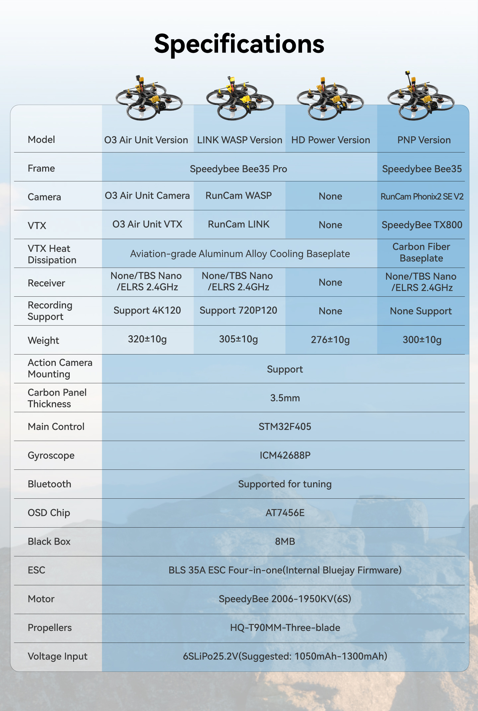

# FPV-dat

## Info 

- [[quadcopter-dat]]

- [[ELRS-dat]] - [[FrSky-dat]] - [[ArduPilot-dat]] - [[CRSF-dat]]
  
- [[BMS-dat]] - [[flight-controller-dat]] - [[ESC-dat]] - [[motor-dat]] - [[propeller-dat]]

- [[camera-FPV-dat]] - [[VTX-dat]]

- [[RC-controller-dat]]

- [[FPV]] - [[DJI-dat]] - [[RC-supplier-dat]]

- [[battery-pack-dat]] - [[power-dat]]

- [[sensor-dat]]  - [[motor-dat]] - [[motor-FPV-dat]]

- [[FPV-accesories-dat]]

- [[betaflight-dat]] - [[RC-configurator-dat]]

- [[indoor-fly-dat]] - [[FPV-load-dat]]

- [[CaddxFPV-dat]] - [[DJI-dat]]

- [[conn-dat]] - [[antenna-dat]]

## build

| indx | parts                     | cost RMB | cost USD/7      | eg. common select |
| ---- | ------------------------- | -------- | --------------- | ----------------- |
| 1    | [[frame-dat]]             | 22.5     | 3               | [[mobula8-dat]]   |
| 2    | [[flight-controller-dat]] | 383      | 55              | [[X12-dat]]       |
| 3    | [[motor-FPV-dat]] x4      | 54       | 8 x4 = 32       | [[EX1103-dat]]    |
| 4    | [[propeller-dat]] x4      | 1.6      | 0.23  x4 = 0.92 | 乾丰2023三叶      |
| 5    | [[VTX-dat]]               | 81       | 11.6            | Caddx ANT 1200TVL |
|      | PCB vibration absorber    | 0        | 0               |                   |
|      | [[XT30-dat]] cable        | 4        | 0.6             |                   |
|      | [[battery-dat]]  x2       | 55       | 7.9 x2 = 15.8   |                   |
|      | [[mobula8-dat]]           |          | 100             |                   |

- [[CONN-dat]]

## popular whoops 

- [[aquila16]]

- indoor build 65mm - [[mobula6-dat]] - meteor65 

## FPV by purposes 

- [[indoor-fly-dat]]

- Tinywhoop = indoor fun.
- Cinewhoop = cinematic close shots.
- Racing = pure speed.
- Freestyle = tricks & acro.
- Long-range = exploration.
- Heavy-lift = pro filmmaking.

### 1. Tiny Whoop

- [[tinywhoop-dat]]

- **Size:** 65–85 mm wheelbase, 1S battery
- **Purpose:** Indoor flying, safe around people/pets, practice
- **Features:** Ducted props, very light, low risk

### 2. Cinewhoop

- [[cinewhoop-dat]]

- **Size:** 85–150 mm wheelbase, 2.5–3.5 inch props
- **Purpose:** Smooth, stable cinematic footage (close proximity / indoors)
- **Features:** Ducted props for safety, carries small action camera (GoPro, Naked GoPro, Insta360)

### 3. Racing Drones

- [[racing-drones-dat]]

- **Size:** 3–5 inch props (120–250 mm wheelbase)
- **Purpose:** Maximum speed and agility for competition
- **Features:** Lightweight, optimized for acceleration, high thrust-to-weight ratio

### 4. Freestyle Quads

- [[freestyle-drones-dat]]

- **Size:** Typically 5 inch props
- **Purpose:** Acrobatics, tricks, expressive flying outdoors
- **Features:** Durable frame, strong motors, smooth response

### 5. Long-Range FPV

- [[long-range-drones-dat]]

- **Size:** 4–7 inch props
- **Purpose:** Extended range flights (kilometers away), exploration
- **Features:** Larger battery, GPS, efficient motors, sometimes wings

### 6. Micro / Toothpick

- [[toothpick-drones-dat]]

- **Size:** 2.5–4 inch props, very light frame
- **Purpose:** Outdoor fun flying, mix of agility and portability
- **Features:** No ducts, higher power-to-weight than Tiny Whoop, still safe-ish

### 7. Heavy-Lift / Cinematic

- [[heavy-lift-drones-dat]]

- **Size:** 6–12 inch props (custom builds)
- **Purpose:** Professional film-making, carrying big cinema cameras (RED, Blackmagic)
- **Features:** Very stable, high payload, expensive

## The best overall FPV drone Starting Kit 

- [[RC-dat]] == [[radiomaster-dat]] = 50 USD

- [[goggles-dat]] == [[walksnail-dat]] = 180 USD

- [[drone-maker-dat]] == [[mobula8-dat]] == [[happymodel-dat]] == 100 USD

- [[betaFPV-dat]] - [[Aquila16-dat]]

## RC configurator 

- [[betaflight-dat]] - [[BLHeli-Configurator-dat]]

- [[FPV-takeoff-checklist-dat]]

## whoop by size 

# FPV Drone Categories Comparison

| Category        | Size (Wheelbase / Prop)  | Weight (approx) | Features                              | Best Use Case                         | Example Models                       |
| --------------- | ------------------------ | --------------- | ------------------------------------- | ------------------------------------- | ------------------------------------ |
| **TinyWhoop**   | 65–75mm / 31–40mm props  | 20–30g          | Ducted, safe, brushed/brushless       | Indoor, beginner, safe around people  | Mobula6, BetaFPV Meteor65            |
| **MicroWhoop**  | 75–100mm / 40–50mm props | 30–60g          | Brushless, small ducts, more power    | Indoor & small outdoor                | Mobula7, Meteor85                    |
| **CineWhoop**   | 3 inch / 120–150mm       | 200–400g        | Ducted, smooth flight, carries camera | Cinematic filming (GoPro/naked GoPro) | GEPRC CineLog 30, iFlight Protek35   |
| **Toothpick**   | 2.5–4 inch / 90–160mm    | 40–120g         | Very light, no ducts, carbon frame    | Outdoor freestyle, nimble flying      | Happymodel Sailfly-X, HX115          |
| **Micro Quad**  | 100–150mm / 2–3 inch     | 70–150g         | Small frame, not always ducted        | Small park freestyle & racing         | Emax Babyhawk II, iFlight Alpha A85  |
| **5-inch Quad** | 210–250mm / 5 inch       | 250–600g        | Most common, powerful, versatile      | Freestyle, racing, cinematic w/ GoPro | ImpulseRC Apex, iFlight Nazgul5      |
| **Long Range**  | 6–7 inch                 | 400–800g+       | Large props, GPS, big batteries       | Long-distance cruising, mountains     | iFlight Chimera7, Flywoo Explorer LR |
| **X-Class**     | 10–13 inch+              | >2kg            | Huge, heavy lift, pro cameras         | Professional filming, commercial work | Shendrones Siccario, custom builds   |

- **Whoop**:  
  - Smallest class, typically **65mm–85mm** frames.  
  - Ducted props (prop guards).  
  - Prop size: ~31–40 mm.  
- **Micro (2"–4")**:  
  - Larger, **90mm–150mm** frames.  
  - Open props (no ducts, usually).  
  - Prop size: **2"–4"**.  

## parts of the FPV drones

- [[flight-controller-dat]]

- [[ESC-dat]]

- **Motors**: Provide the thrust needed for flight. Brushless motors are commonly used in FPV drones due to their efficiency and power.

- **Propellers**: Generate lift by spinning rapidly. The size and pitch of the propellers can significantly affect the drone's performance and flight characteristics.

- [[SCU1059-dat]] - [[propeller-dat]]

- **Camera**: Captures real-time video for FPV flying. FPV cameras are designed to provide low-latency video transmission to the pilot's goggles or screen.

- [[VTX-dat]]: Video Transmitters are commonly referred to as VTX units. They are responsible for transmitting the video signal from the camera to the pilot's goggles or screen. VTX units come in various power levels and frequencies, allowing pilots to choose the best option for their flying environment.
- **Antenna**: Enhances the signal strength and range of the VTX. Different antenna types (e.g., dipole, patch, circular polarized) can be used to optimize performance.

- **ExpressLRS**: A long-range radio control link for FPV drones, known for its low latency and high refresh rates. It is an open-source project that competes with other systems like Crossfire and ELRS.

  - [[ELRS-dat]]

- **Goggles**: Wearable displays that allow pilots to see the live video feed from the drone's camera. They often include features like head tracking and DVR (Digital Video Recorder) capabilities.

## Bee35

| version                    | price | description                           |
| -------------------------- | ----- | ------------------------------------- |
| Bee35 Pro O3 Air Unit TBS  | 480   | O3 Air Unit, TBS radio                |
| Bee35 Pro O3 Air Unit ELRS | 470   | O3 Air Unit, ELRS radio               |
| Bee35 Pro O3 Air Unit PNP  | 460   | O3 Air Unit, no receiver              |
| Bee35 Pro                  | 270   | Standard analog version               |
| Bee35 Pro LINK WASP TBS    | 430   | LINK WASP digital system, TBS radio   |
| Bee35 Pro LINK WASP ELRS   | 420   | LINK WASP digital system, ELRS radio  |
| Bee35 Pro LINK WASP PNP    | 400   | LINK WASP digital system, no receiver |
| Bee35 Analog TBS           | 306   | Analog FPV system, TBS radio          |
| Bee35 Analog ELRS          | 296   | Analog FPV system, ELRS radio         |

## commerialized FPV

- [[speedybee-dat]]

### 1. [SpeedyBee Flight Controllers & Stacks](https://speedybee.com/)
- **Brand:** SpeedyBee  
- **Description:** Budget-friendly, Betaflight-supported flight controllers with easy app-based tuning.  
- **Example Products:**  
  - **SpeedyBee F405 V4 Stack** (F4-based, affordable)  
  - **SpeedyBee F7 V3 Stack** (F7-based, powerful & feature-rich)  
- **Commercial Features:**  
  - Wireless **Bluetooth & Wi-Fi tuning** via SpeedyBee app.  
  - Fully compatible with Betaflight Configurator.  
- **Website:** [speedybee.com](https://speedybee.com/)  

---

### 2. [TBS Tango 2 (Crossfire-Integrated Radio Controller)](https://www.team-blacksheep.com/)
- **Brand:** Team BlackSheep (TBS)  
- **Description:** A high-performance FPV radio transmitter designed for **Betaflight-based drones** with **built-in Crossfire**.  
- **Commercial Features:**  
  - Fully optimized for **Betaflight & Crossfire**.  
  - Compact, ergonomic design for FPV pilots.  
- **Website:** [team-blacksheep.com](https://www.team-blacksheep.com/)  

## opensource control projects 

# Most Famous Open-Source FPV GitHub Projects

If you're looking for **open-source FPV (First-Person View) projects** on GitHub, here are some of the **most famous** ones:

## 1. [Betaflight](https://github.com/betaflight/betaflight)
- **Description:** One of the most widely used open-source flight control firmware for FPV drones.
- **Features:**
  - Highly optimized for **acrobatic** and **racing drones**.
  - Supports a wide range of flight controllers.
  - Advanced **tuning options** for PID, filters, and motor control.
- **GitHub:** [github.com/betaflight/betaflight](https://github.com/betaflight/betaflight)

---

## 2. [iNavFlight](https://github.com/iNavFlight/inav)
- **Description:** A fork of Betaflight, but optimized for **GPS and long-range FPV**.
- **Features:**
  - Supports **GPS waypoint navigation, return-to-home (RTH), and mission planning**.
  - Designed for **freestyle and long-range cruising** rather than racing.
- **GitHub:** [github.com/iNavFlight/inav](https://github.com/iNavFlight/inav)

---

## 3. [ArduPilot](https://github.com/ArduPilot/ardupilot)
- **Description:** A professional-grade open-source autopilot for drones, including **FPV quadcopters, planes, and rovers**.
- **Features:**
  - **Highly autonomous** with advanced mission planning.
  - Works with multiple types of vehicles (planes, multirotors, helicopters).
  - Compatible with **Mission Planner** and **QGroundControl**.
- **GitHub:** [github.com/ArduPilot/ardupilot](https://github.com/ArduPilot/ardupilot)

---

## 4. [PX4](https://github.com/PX4/PX4-Autopilot)
- **Description:** A powerful open-source **flight control software** used in drones and FPV systems.
- **Features:**
  - Supports both **FPV racing drones** and **autonomous UAVs**.
  - Works with Pixhawk flight controllers and supports **ROS (Robot Operating System)**.
- **GitHub:** [github.com/PX4/PX4-Autopilot](https://github.com/PX4/PX4-Autopilot)

---

## 5. [FalcoX](https://github.com/FlightOne/FalcoX)
- **Description:** An alternative FPV flight control firmware focusing on **ease of use and smooth flight performance**.
- **Features:**
  - Intuitive configuration interface.
  - Aimed at both **freestyle pilots** and **racers**.
- **GitHub:** [github.com/FlightOne/FalcoX](https://github.com/FlightOne/FalcoX)

---

## 6. [ExpressLRS](https://github.com/ExpressLRS/ExpressLRS)
- **Description:** Open-source long-range **radio control link** for FPV drones, competing with Crossfire and ELRS.
- **Features:**
  - **Low latency and high refresh rates** (great for FPV racing).
  - Compatible with many radio transmitters (TBS, Jumper, Radiomaster).
- **GitHub:** [github.com/ExpressLRS/ExpressLRS](https://github.com/ExpressLRS/ExpressLRS)

---

## 7. [OpenHD](https://github.com/OpenHD/OpenHD)
- **Description:** Open-source **HD video transmission** for FPV drones (alternative to DJI HD systems).
- **Features:**
  - Uses **Raspberry Pi + WiFi** for HD FPV video streaming.
  - Supports OSD (On-Screen Display) and telemetry data.
- **GitHub:** [github.com/OpenHD/OpenHD](https://github.com/OpenHD/OpenHD)

---

## 🔥 Which One Should You Choose?
| Purpose                                     | Best Open-Source Project                               |
| ------------------------------------------- | ------------------------------------------------------ |
| **Racing/Freestyle FPV**                    | [Betaflight](https://github.com/betaflight/betaflight) |
| **GPS & Long-Range FPV**                    | [iNav](https://github.com/iNavFlight/inav)             |
| **Full Autopilot (Drones, Planes, Rovers)** | [ArduPilot](https://github.com/ArduPilot/ardupilot)    |
| **Professional UAVs & Research**            | [PX4](https://github.com/PX4/PX4-Autopilot)            |
| **HD FPV Video Streaming**                  | [OpenHD](https://github.com/OpenHD/OpenHD)             |
| **Long-Range Radio Links**                  | [ExpressLRS](https://github.com/ExpressLRS/ExpressLRS) |

## standards 

### PNP stands for "Plug and Play." 

In the context of FPV drones, a PNP version means that the drone comes mostly assembled but does not include a radio receiver.

Here's why it doesn't include a receiver:

Flexibility: PNP versions cater to experienced FPV pilots who already have their preferred radio transmitter and receiver. This allows them to use their existing equipment and avoid paying for redundant components.
Customization: Pilots might have specific receiver requirements based on their radio system (e.g., TBS Crossfire, ELRS, FrSky). Offering a PNP version lets them choose the exact receiver that's compatible with their setup.
Cost Savings: By excluding the receiver, the manufacturer can offer the PNP version at a lower price point, making it attractive to those who don't need the included receiver.
In short, PNP versions are designed for users who want to use their own radio gear and prefer to avoid unnecessary costs or compatibility issues.

## popular products 

DJI 

- [DJI Avata 2 (Drone Only), FPV Drone with Camera 4K, Immersive Flight Experience, Built-in Propeller Guard, Easy Flip/Roll, Super-Wide 155° FOV, Compatible with RC Motion 3, FAA Remote ID Compliant](https://www.amazon.com/DJI-Immersive-Experience-Super-Wide-Compatible/dp/B0CS6KY96F/ref=sr_1_45?dib=eyJ2IjoiMSJ9.85xi15ftM4OWw33_siXrDRGNOKuf3CgQct4cVlBOFqI1ZAAZD4Gz_S4U_wqEKgjxWcsGOZPlWkdGdEASaTJntO1H_pFgsXO61wuEgveKAmLTLHR-cjsa5SOhaKUXU0vVHE7oijzqLoIPsx-H55gYNPr_F8aMX98OqPfwk64Ma12qrNSidLDVokmdegWL621v3U-5PDEaMNTjdACgOTHEBxAGhtxksaYVouWcSkxMCTI-jr0FkvxyQeZmO6S-UjXJcEcChxa4sPMjVyiK7070XhJlH2EnXqgnv0KScl80Jqc.AzbbGJAa2ls6bQWRCrudB-jGcm6vKV7pRItsIyBMpdA&dib_tag=se&keywords=FPV&qid=1744201259&sr=8-45)

BetaFPV 

- [BETAFPV Betaflight ELRS V3 Cetus X FPV Kit with LiteRadio 3 Transmitter C04 Camera VR03 Goggles with DVR Recording Function, Supported 2S Power Advanced RTF Kit for FPV Beginners to Fly Faster Further](https://www.amazon.com/BETAFPV-LiteRadio-Transmitter-Recording-Betaflight/dp/B0BJVP3XW7/ref=sr_1_48?dib=eyJ2IjoiMSJ9.85xi15ftM4OWw33_siXrDRGNOKuf3CgQct4cVlBOFqI1ZAAZD4Gz_S4U_wqEKgjxWcsGOZPlWkdGdEASaTJntO1H_pFgsXO61wuEgveKAmLTLHR-cjsa5SOhaKUXU0vVHE7oijzqLoIPsx-H55gYNPr_F8aMX98OqPfwk64Ma12qrNSidLDVokmdegWL621v3U-5PDEaMNTjdACgOTHEBxAGhtxksaYVouWcSkxMCTI-jr0FkvxyQeZmO6S-UjXJcEcChxa4sPMjVyiK7070XhJlH2EnXqgnv0KScl80Jqc.AzbbGJAa2ls6bQWRCrudB-jGcm6vKV7pRItsIyBMpdA&dib_tag=se&keywords=FPV&qid=1744201259&sr=8-48) == rating == 3.5 

- [BETAFPV Pavo20 Brushless Whoop Quadcopter with HD Digital Bracket for O3 Air Unit, F4 2-3S 20A FC, 1103 8500KV Motor, COB LED Strip, Compatible for FPV Racing Indoor and Outdoor](https://www.amazon.com/BETAFPV-Brushless-Quadcopter-Material-Compatible/dp/B0CKT5G6C1/ref=sr_1_11?crid=1KCLBGZLCPWMM&dib=eyJ2IjoiMSJ9.u8zpDMqhQLF9cnPbc5r76LO9SVPJiVyPzTq0xdtVa2u4UYSXdyYl9H-Z3gMzqguhRBkKgkoRZWaxBHDFD6BRFsCQJKVb4iWibNm9DVSzo8jjnyx10jKEMfQICYMtZJab4CpDzmZXALE0VqfYmsl2b2z6zA536zmhj3MbQfvXxqOrlO8RzQiYLdFv-lIZbHe3VqkD5N2AuBL25TgOETuGrMPmYt7Yhvu1G4lry067nFXe06m0NOi7YGC9HehoblQsTDd1-4IPkuJfZGdR6OljCFD_F9mIqaJ-dIPMlULs8kg.m1NOD5DB1dn9oAtRj6kjXh5UkWTCRb94gNjUZ8Owz8Y&dib_tag=se&keywords=betafpv&qid=1744202445&sprefix=beta%2Caps%2C676&sr=8-11) == rating == 4.1 

SpeedyBee Frame 

- [Speedy Bee Bee35 3.5inch Cinewhoop FPV Drone Frame- Pro Version 4S 6S Frame Kit Compatible with DJI O3 Air Unit FPV VTX,Different Flight Controller Stack](https://www.amazon.com/3-5inch-Cinewhoop-Compatible-Different-Controller/dp/B086X5M24H/ref=sr_1_1?dib=eyJ2IjoiMSJ9.flOlB5a6W8Z4mxOLR-K_BDlWDFVnqHJ69LrRLHzsG3Vt1_EuF1CQCJw-erVA1bWn.aK6G-MxmMYmSkACuczQuR4yI0PIn2BzHbY4-bbiXRLo&dib_tag=se&keywords=bee35&qid=1744202041&sr=8-1)

## BEE25 

Propeller Size: 2.5 inches

The SpeedyBee Bee25 is a compact 2.5-inch cinewhoop drone designed for agility and portability, especially suited for indoor and tight-space flying.

## wheelbase 

In FPV drones, the **wheelbase** refers to the **diagonal distance between the centers of the two furthest-apart motors**, usually measured in **millimeters (mm)**. It’s a standard way to classify the size of a drone frame.

---

### 🧩 Why Wheelbase Matters

- **Determines Propeller Size**: Larger wheelbase = larger props supported.
- **Affects Maneuverability**: Smaller wheelbase = more agile, Larger = more stable.
- **Influences Payload**: Bigger wheelbase frames can carry heavier gear (e.g., action cameras, larger batteries).

---

### 📏 Common FPV Drone Wheelbase Categories

| Size Category  | Typical Wheelbase | Prop Size | Usage                            |                              |
| -------------- | ----------------- | --------- | -------------------------------- | ---------------------------- |
| **Tiny Whoop** | 65–75 mm          | 31–40 mm  | Indoor, safe micro flying        | Meteor75, Aquila16           |
| **Micro**      | 85–120 mm         | 2"–2.5"   | Indoor/outdoor, cinewhoop        | BEE25, Pavo25, Pavo20 = 90mm |
| **Mini**       | 130–180 mm        | 3"–4"     | Freestyle, racing                |                              |
| **Standard**   | 200–250 mm        | 5"        | Freestyle, long-range, cinematic |                              |
| **Large**      | 250+ mm           | 6"+       | Long-range, heavy payloads       |                              |

---

### 📌 Examples

- **Meteor75** → **75mm wheelbase** → Tiny Whoop class
- **SpeedyBee Bee25** → **120mm wheelbase** → Micro/Cinewhoop class

- cinelog-25

- [[FPV-load-dat]]

- [[drone-maker-dat]]

## FPV tech 

### Multi-Sensor Fusion
- **IMU (Inertial Measurement Unit)**: Detects acceleration and angular velocity changes.  
- **GPS / GLONASS / Galileo**: Provides precise global positioning for drift correction.  
- **Barometer**: Measures altitude changes due to vertical wind.  
- **Vision Positioning System (VPS)**: Assists in holding position when GPS is weak or unavailable.  

All sensor data are fused together for real-time position and attitude correction.

Drones estimate wind speed using GPS drift and IMU feedback.

If it exceeds safe thresholds (e.g., >12 m/s), the system:

- Limits tilt angles.
- Warns the pilot.
- Plans **energy-efficient return routes** considering wind direction.

### 🧰 How to Improve Betaflight Wind Handling

If you want DJI-like stability in a Betaflight-based drone, you can try:

- **Use “Angle” or “Horizon” mode** — these self-level automatically.
- **Tune PID properly** — higher D-term helps fight oscillations caused by gusts.
- **Use a heavier frame** — more mass = less effect from wind.
- **Add GPS + switch to iNav or Ardupilot** — they support position hold and altitude hold.
- **Use high-quality ESCs and motors** for faster response.

### DJI VS betaflight 

# DJI vs Betaflight Comparison Table

| Feature / Capability | **DJI Drones** | **Betaflight (Typical FPV Quad)** | Explanation |
|-----------------------|----------------|----------------------------------|--------------|
| **Main Purpose** | Aerial photography, autonomous flight | FPV racing, freestyle acrobatics | DJI focuses on automation and stability, Betaflight on agility and control. |
| **Flight Control Algorithm** | PID + MPC (Model Predictive Control) + Sensor Fusion | PID only | DJI uses predictive and adaptive control; Betaflight uses classic PID. |
| **Sensor Fusion** | Yes (IMU + GPS + Barometer + Vision Sensors) | Limited (IMU only) | DJI fuses multiple sensors for precision control; Betaflight relies mainly on IMU. |
| **GPS Position Hold** | ✅ Built-in | ⚠️ Requires external GPS + iNav/Ardupilot | Betaflight doesn’t handle position hold natively. |
| **Vision Positioning (VPS)** | ✅ Yes | ❌ No | DJI uses downward cameras for indoor stability. |
| **Altitude Hold** | ✅ Precise (barometer + GPS + VPS) | ⚠️ Basic (Angle mode only) | DJI maintains accurate height even in wind; Betaflight does not. |
| **Wind Resistance / Compensation** | ✅ Automatic | ❌ Manual (pilot controlled) | DJI detects and corrects wind drift automatically. |
| **Return to Home (RTH)** | ✅ Smart, automatic | ⚠️ Only with GPS add-ons | DJI calculates safe routes; Betaflight doesn’t. |
| **Wind Estimation & Feedforward Control** | ✅ Yes | ❌ No | DJI predicts wind disturbance and adjusts preemptively. |
| **IMU Attitude Stabilization** | ✅ Yes | ✅ Yes | Both can stabilize attitude, but DJI integrates more sensors. |
| **Motor Control Response** | High-speed ESCs with adaptive algorithms | High-speed ESCs (pilot-driven) | DJI adjusts motor speeds automatically; Betaflight follows pilot commands. |
| **User Control Focus** | Semi/fully autonomous | Fully manual | DJI reduces workload; Betaflight gives full manual control. |
| **System Complexity** | High (proprietary flight controller, AI algorithms) | Moderate (open-source firmware) | DJI uses closed systems with advanced computation. |
| **Tuning Requirement** | Minimal (auto-calibration) | Manual PID tuning needed | DJI tunes itself; Betaflight requires user tuning. |
| **Firmware Platform** | Proprietary DJI Flight Controller | Open-source Betaflight | DJI closed system vs Betaflight open community. |
| **Use Case Summary** | Stable, cinematic, automated | Fast, agile, pilot-skill-based | Different design goals and priorities. |

---

### 🧭 Summary

- **DJI** = Stability, automation, wind resistance, and ease of use.  
- **Betaflight** = Agility, manual control, and racing performance.  

If you want DJI-like wind compensation on a custom drone, use **iNav** or **Ardupilot** instead of Betaflight — they support GPS position hold, altitude hold, and auto-leveling with similar logic to DJI.

## ref 

- [[FPV]]