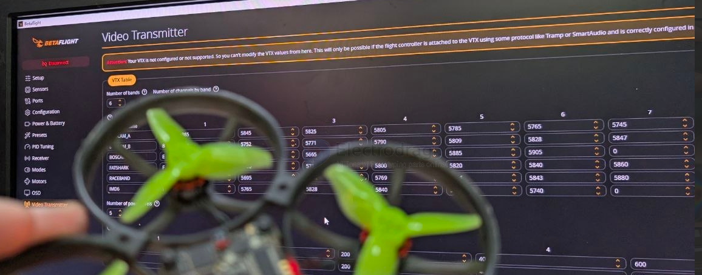

# FPV-fix-dat

- [[PCB-fix-dat]] - [[FPV-fix-dat]] - [[electronic-consumer-fix-dat]]

- [[mosfet-drive-dat]] - [[X12-dat]] - [[FPV-dat]] - [[FPV-fix-dat]]

- [[EFM8-dat]]

- [[EFM8-dat]] - [[ESC-dat]] - [[FPV-fix-dat]]

- [[PCB-fix-dat]] - [[FPV-fix-dat]]

## replaceable parts 

- [[camera-FPV-dat]] - [[camera-FPV]] - [[camera]]

## fix scenario 

scneario 1. 

- [[FPV-fix-dat]] - [[PCB-fix-dat]] - [[betaflight-video-transmitter-dat]]

Your VTX is not configured or not supported. So you can't modify the VTX values from here. This will only be possible if the flight controller is attached to the VTX using some protocol like Tramp or SmartAudio and is correctly configured in the Ports tab if needed.

## power up checklist 

- power up self-check sound 
- [[sensor-motion-dat]] in [[betaflight-dat]] 
- [[ESC-dat]] - [[EFM8-dat]]
- [[PCB-fix-dat]] - [[FPV-fix-dat]]

- [[FC-AIO-dat]] - [[ESC-dat]] - [[X12-dat]] - [[test-point-dat]] == pin 4 (VCC) and 5 

## 为什么 4 路全部无输出、无自检音？

每路都有独立的一套 1N + L1 + R + C，它们绝不可能在撞击中 4 套同时坏掉！

唯一的可能：这 4 套驱动电路共同连接的「上游供电源」断了！

请顺着看二极管 L1 的阳极（Anode，没有白杠的一端），或者 上拉电阻 R1 的电源端：
- 它们必须并联到一个公共供电节点（V_DRIVE）上。
- 如果这个公共供电为 0V：
  - 二极管无法给电容充入驱动电荷。
  - 上拉电阻两端没有电压，主功率 MOSFET 的 G 极永远是 0V。
  - 1N 就算怎么开关，G 极依然是 0V，主功率 MOSFET 永远锁死在关闭状态！
  - 这就造成：EFM8 拼命发信号、发自检音波形，但主功率管纹丝不动，完全没有电流流过电机！

## common drive 

1. 公共地（GND）：MOSFET 的源极（S）到底通不通电池负极焊盘？（前面提到的测点一）
2. 公共驱动供电（V_drive）：给那 12 组驱动二极管/三极管供电的母线是否断裂？
3. 公共复位/使能（Reset/Enable）：EFM8 虽能与电脑通信，但功率输出是否被板级硬件引脚全部钳位？

## ref 

